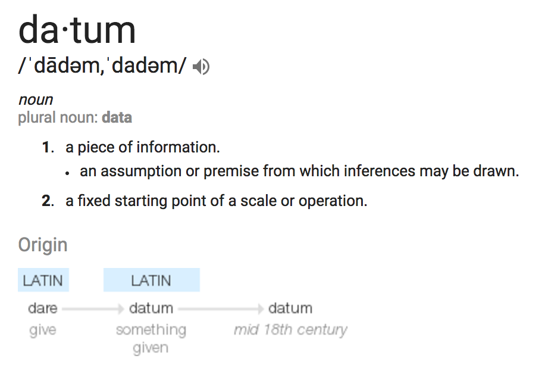

```{r 01_setup, include=FALSE}
knitr::opts_chunk$set(echo=TRUE, error=TRUE)
library(tufte)
library(tidyverse)
library(ggplot2)
library(ggmap)
library(tint)
#options(htmltools.dir.version = FALSE)
```

# (PART) Foundation {.unnumbered}

# Intro to R, RStudio, and R Markdown

## Learning Goals {.unnumbered}

-   Download and install the necessary tools (R, RStudio)
-   Develop comfort in navigating the tools in RStudio
-   Develop comfort in writing and knitting a R Markdown file
-   Identify the characteristics of tidy data
-   Use R code: as a calculator and to explore tidy data

## Getting Started in RStudio {.unnumbered}

As you might guess from the name, "Data Science" requires *data*. Working with modern (large, messy) data sets requires statistical software. We'll exclusively use **RStudio**. Why?

-   it's free\
-   it's open source (the code is free & anybody can contribute to it)
-   it has a huge online community (which is helpful for when you get stuck)\
-   it's one of the industry standards\
-   it can be used to create *reproducible* and lovely documents (In fact, the course materials that you're currently reading were constructed entirely within RStudio!)

### Download R & RStudio {.unnumbered}

To get started, take the following two steps *in the given order*. Even if you already have R/RStudio, make sure to update to the most recent versions.

1.  Download and install the R statistical software at <https://mirror.las.iastate.edu/CRAN/>\
2.  Download and install the FREE version of RStudio at <https://www.rstudio.com/products/rstudio/download/#download>

If you are having issues with downloading, log on to <https://rstudio.macalester.edu/> (use Mac credentials) to use the RStudio server.

What's the difference between R and RStudio? Mainly, RStudio requires R -- thus it does everything R does *and more*. We will be using RStudio exclusively.

### A quick tour of RStudio {.unnumbered}

Open RStudio! You should see four panes, each serving a different purpose:

```{r fig-main,echo=FALSE,fig.cap="RStudio Interface"}
knitr::include_graphics("images/RStudioImage.jpg")
```

This short [video tour of RStudio](http://www.youtube.com/embed/JfIo2Ua_oqQ/) summarizes some basic features of the *console*.

```{exercise, name="Warm Up"}
Use RStudio as a simple calculator to do the following:
  
  1) Perform a simple calculation: calculate `90/3`.
  2) RStudio has built-in *functions* to which we supply the necessary *arguments*:  `function(arguments)`.  Use the built-in function `sqrt` to calculate the square root of 25.
  3) Use the built-in function `rep` to repeat the number "5" eight times.
  4) Use the `seq` function to create the vector `(0, 3, 6, 9, 12)`.  (The video doesnt cover this!)
  5) Create a new vector by concatenating three repetitions of the vector from the previous part.
```

<details>

<summary>Solution</summary>

```{r, collapse=TRUE}
90/3 

sqrt(25)

rep(5, times = 8)

seq(0, 12, by = 3)

rep(seq(0, 12, by = 3), times =  3)

rep(seq(0, 12, by = 3), each = 3) #notice the difference between times and each
```

</details>

\

```{exercise, name="Assignment", label="assignment"}
We often want to store our output for later use (why?).  The basic idea in RStudio:    
  
    `name <- output`
  
Copy and paste the following code into the console, line by line.  NOTE:  RStudio ignores any content after the `#`.  Thus we use this to 'comment' and organize our code.    
```

```{r eval=FALSE}
#type square_3
square_3
    
#calculate 3 squared
3^2    
    
#store this as "square_3"
square_3 <- 3^2    
    
#type square_3 again!
square_3
    
#do some math with square_3
square_3 + 2
```

### Data {.unnumbered}

Not only does "Data Science" require statistical software, it requires *DATA*! Consider the Google definition:

```{r echo=FALSE,fig.cap="A datum."}

```

With this definition in mind, which of the following are examples of data?

-   tables

```{r echo=FALSE, warning=FALSE, message=FALSE}
library(mosaic)
data(Galton)
head(Galton)
```

-   [photo](https://www.google.com/search?hl=en&biw=1439&bih=656&tbm=isch&sa=1&q=messy+college+dorm+rooms&oq=messy+college+dorm+rooms&gs_l=psy-ab.3...20720.21922.0.22183.6.6.0.0.0.0.143.552.4j2.6.0....0...1.1.64.psy-ab..1.1.142...0i13k1.uaj5gYQ4t50)

-   [video](https://www.youtube.com/watch?v=wMm7VdH05jY)

-   [text / tweets](https://twitter.com/data4blacklives?lang=en)

We'll mostly work with data that look like this:

```{r echo=FALSE, warning=FALSE, message=FALSE}
library(mosaic)
data(Galton)
head(Galton)
```

This isn't as restrictive as it seems. We can convert the above signals: photos, videos, and text to a data table format!

### Tidy Data {.unnumbered}

**Example:** After a scandal among FIFA officials, fivethirtyeight.com posted an analysis of FIFA viewership, ["How to Break FIFA"](https://fivethirtyeight.com/features/how-to-break-fifa/). Here's a snapshot of the data used in this article:

```{r echo=FALSE}
suppressPackageStartupMessages(library(fivethirtyeight))
data("fifa_audience")
suppressPackageStartupMessages(library(knitr))
kable(head(fifa_audience,10))
fifa <- fifa_audience
```

The data table above is in *tidy* format. *Tidy* data tables have three key features:

1.  Each row represents a **unit of observation** (also referred to as a case).\
2.  Each column represents a **variable** (ie. an attribute of the cases that can vary from case to case). Each variable is one of two types:\

-   **quantitative** = numerical\
-   **categorical** = discrete possibilities/categories\

3.  Each entry contains a single data value; no analysis, summaries, footnotes, comments, etc., and only one value per cell


```{exercise, name="Units of Observation and Variables"}
Consider the following in a group:   
```

a.  What are the units of observation in the FIFA data?\
b.  What are the variables? Which are quantitative? Which are categorical?\
c.  Are these *tidy* data?

<details>

<summary>Solution</summary>

a.  A FIFA member country
b.  country name, soccer or football confederation, country's share of global population (percentage), country's share of global world cup TV Audience (percentage), country's GDP-weighted audience share (percentage)
c.  Yes

</details>

\

```{exercise name="Tidy vs. Untidy"}
Check out the following data.  Explain to each other why they are untidy and how we can tidy them.    
  
  a. Data 1: FIFA    
    
              country  confederation  population share    tv_share
        ------------- -------------- ----------------- ----------- ------------------
        United States       CONCACAF     i don't know*       4.3%  *look up later      
                 Japan           AFC               1.9       4.9%
                 China           AFC              19.5      14.8%    
                                                        total=24%           
  
  b. Data 2: Gapminder life expectancies by country    
        
                          country  1952  1957  1962
        ------------ ------------ ----- ----- -----
                Asia  Afghanistan  28.8  30.3  32.0
                          Bahrain  50.9  53.8  56.9    
              Africa      Algeria  43.0  45.7  48.3    

```

<details>

<summary>Solution</summary>

a.  There are notes such as "I don't know" and "look up later" in columns with numeric values; the last row with the total is a summary. We could remove the text notes, replace it with the value if known, and remove the last row with the total summary.
b.  The first column does not have a row name. It should be continent. Additionally, Bahrain needs a value for the continent.

</details>

\

### Data Basics in RStudio {.unnumbered}

For now, we'll focus on *tidy* data. In a couple of weeks, you'll learn how to turn untidy data into tidy data.

```{exercise, name="Importing Package Data"}
The first step to working with data in RStudio is getting it in there!  How we do this depends on its format (eg: Excel spreadsheet, csv file, txt file) and storage locations (eg: online, within Wiki, desktop).  Luckily for us, the `fifa_audience` data are stored in the `fivethirtyeight` RStudio package. Copy and paste the following code into the Console and press Enter.
```

```{r eval=FALSE}
#download the data and information in the fivethirtyeight package (we only need to do this once)
install.packages('fivethirtyeight')

#load the fivethirtyeight package
library(fivethirtyeight)
    
#load the fifa data
data("fifa_audience")
    
#store this under a shorter, easier name
fifa <- fifa_audience
```

```{exercise, name="Examining Data Structures"}
Before we can analyze our data, we must understand its structure.  Try out the following functions (copy and paste into the Console).  For each, make a note that describes its action.  
```

```{r eval=FALSE}
#(what does View do?)
View(fifa)  

#(what does head do?)
head(fifa)  

#(what does dim do?)
dim(fifa)           

#(what does names do?)
names(fifa)         
```

<details>

<summary>Solution</summary>

```{r, collapse=TRUE}
#View() opens up a new tab with a spreadsheet preview of the data to visually explore the data. It is commented out in the Rmarkdown file because this is an interactive feature
#View(fifa)  

#head() gives the first 6 (default number) rows of a data set
head(fifa)  

#dim() gives the number of rows and number of columns
dim(fifa)           

#names() gives the names of the columns/variables
names(fifa)   
```

</details>

\

```{exercise, name="Codebooks"}
Data are also only useful if we know what they measure!  The `fifa` data table is *tidy*; it doesn't have any helpful notes in the data itself.
```

Rather, information about the data is stored in a separate *codebook*. Codebooks can be stored in many ways (eg: Google docs, word docs, etc). Here the authors have made their codebook available in RStudio (under the original `fifa_audience` name). Check it out (run the following code in the console):

```{r eval=FALSE}
?fifa_audience
```

a.  What does `population_share` measure?
b.  What are the units of `population_share`?

<details>

<summary>Solution</summary>

a.  Country's share of global population
b.  Percentage between 0 and 100

</details>

 

```{exercise, name="Examining a Single Variable"}
Consider the following:
```

a.  We might want to access and focus on a single variable. To this end, we can use the `$` notation (see below). What are the values of `tv_audience_share`? Of `confederation`? Is it easy to figure out?

```{r eval=FALSE}
fifa$tv_audience_share
fifa$confederation
```

It's important to understand the format/class of each variable (quantitative, categorical, date, etc) in both its meaning and its structure within RStudio:

```{r eval=FALSE}
class(fifa$tv_audience_share)
class(fifa$confederation)
```

b.  If a variable is categorical (in `factor` format), we can determine its `levels` / category labels. What are the value of `confederation`?

```{r eval=FALSE}
levels(fifa$confederation) #it is in character format
levels(factor(fifa$confederation)) #we can convert to factor format
```

## R Markdown and Reproducible Research {.unnumbered}

> **Reproducible research** is the idea that data analyses, and more generally, scientific claims, are published with their data and software code so that others may verify the findings and build upon them. - [Reproducible Research, Coursera](https://www.coursera.org/learn/reproducible-research)

Useful Resources:

1.  [R Markdown Quick Tour](http://rmarkdown.rstudio.com/authoring_quick_tour.html)\
2.  [R Markdown Cheatsheet](https://github.com/rstudio/cheatsheets/raw/main/rmarkdown-2.0.pdf) 
3.  [R Markdown Reference Guide](https://www.rstudio.com/wp-content/uploads/2015/03/rmarkdown-reference.pdf) 

Research often makes claims that are difficult to verify. A recent [study of published psychology articles](http://science.sciencemag.org/content/349/6251/aac4716) found that less than half of published claims could be reproduced. One of the most common reasons claims cannot be reproduced is confusion about data analysis. It may be unclear exactly how data was prepared and analyzed, or there may be a mistake in the analysis.

In this course we will use an innovative format called R Markdown that dramatically increases the transparency of data analysis. R Markdown interleaves data, R code, graphs, tables, and text, packaging them into an easily publishable format.

To use R Markdown, you will write an R Markdown formatted file in RStudio and then ask RStudio to **knit** it into an HTML document (or occasionally a PDF or MS Word document).

```{exercise name="Deduce the R Markdown Format"}
Look at this [Sample RMarkdown](http://www.statpower.net/Content/310/R%20Stuff/SampleMarkdown.Rmd) and the [HTML webpage](http://www.statpower.net/Content/310/R%20Stuff/SampleMarkdown.html) it creates. Consider the following and discuss:
    
a) How are bullets, italics, and section headers represented in the R Markdown file?
b) How does R code appear in the R Markdown file?
c) In the HTML webpage, do you see the R code, the output of the R code, or both?
```

<details>

<summary>Solution</summary>

``` {collapse="TRUE"}
Bullets are represented with * and +
Italics are represented with * before and after a word or phrase
Section headers are represented with #

R code chunks are between 3 tick marks at the beginning and end; it is R code if there is an r in curly braces
  
If echo=FALSE in curly braces, the code is not shown. Otherwise, both code and output are shown by default.
```

</details>

 

Now take a look at the [R Markdown cheatsheet](https://github.com/rstudio/cheatsheets/raw/main/rmarkdown-2.0.pdf). Look up the R Markdown features from the previous question on the cheatsheet. There's a great deal more information there.

## Practice {.unnumbered}

Complete the following. If you get stuck along the way, refer to the R Markdown cheatsheet linked above, search the web for answers, and/or ask for help!

```{exercise name="Your First R Markdown File"}
Create a new R Markdown about your favorite food.    

a. Create a new file in RStudio (File -> New File -> R Markdown) with a Title of `First_Markdown`. Save it to a new folder on your Desktop called `COMP_STAT_112`; within that new folder, create another new folder called `Day_01`.  
b. Make sure you can compile/render (Knit) the Markdown into a webpage (html file).  
c. Add a new line between `title` and `output` that reads: `author: Your Name`.
d. Create a very brief essay about your favorite food. Make sure to include:    
  * A picture from the web    
  * A bullet list    
  * A numbered list  
e. Compile (Knit) the document into an html file.
```

```{exercise name="New Data!"}
There's a data set named `comic_characters` in the `fivethirtyeightdata` package.
```

Install the package by running the following in the Console:

```
install.packages('fivethirtyeightdata', repos = 'https://fivethirtyeightdata.github.io/drat/', type = 'source')
```

Check out the codebook (hint: use ?) to understand what these data measure. Then add a second section to your R Markdown file, and then use code chunks and R commands to perform/answer the following tasks/questions:
  
  a. Load the data.    
  b. What are the units of observation?  How many observations are there?    
  c. In a new code chunk, print out the first 12 rows of the data set.
  d. Get a list of all variable names.  
  e. What's the class of the `date` variable?   
  f. List all of the unique entries in the `gsm` variable (no need to include NA).
  g. Compile the document into an html file.

## Appendix: R Functions {-}

### R as a calculator {-}


| Function/Operator       | Action           | Example  |
| ------------- |:-------------:| -----:|
| `/`           | Division     |    `90/30` |
| `*`           | Multiplication      |   `2*5`|
| `+`           | Addition      |   `1+1` |
| `-`           | Subtraction      |   `1-1` |
| `^`           | Exponent/Power to      |   `3^2` |
| `sqrt(x)`           | Square root      |   `sqrt(25)` |


### R Basics {-}


| Function/Operator       | Action           | Example  |
| ------------- |:-------------:| -----:|
| `install.packages('packagename')`           | Download a R package (function, data, etc.) from repository      |   `install.packages('fivethirtyeight')` |
| `library(packagename)`           | Access a downloaded R package    |   `library(fivethirtyeight)` |
| `?function_object_name`           | Opens the help/documentation for the function or object |   `?seq` |
| `rep(x, times, each)`           | Repeat x a # times    |    `rep(5,8)` |
| `seq(from,to,by)`           | Sequence generation      |   `2*5`|
| `name <- value_output`           | Assign value or output to a name      |   `squared_3 <- 3^2` |
| `View(x)`           | Open spreadsheet viewer of dataset   |   `View(fifa_audience)` |
| `head(x)`           | Print the first 6 rows of a dataset     |   `head(fifa_audience)` |
| `dim(x)`           | Print the dimensions (number of rows and columns) of a dataset    |   `dim(fifa_audience)` |
| `names(x)`           | Print the names of the variables in a dataset |   `names(fifa_audience)` |
| `$`           | Used to access one variable in a data set based on its name |   `fifa_audience$confederation` |
| `class(x)`           | Print the class types argument or input |   `class(fifa_audience$confederation)` |
| `factor(x)`           | Converts the argument or input to a factor class type (categorical variable) |   `factor(fifa_audience$confederation)` |
| `levels(x)`           | Prints the unique categories of a factor |   `levels(factor(fifa_audience$confederation))` |


