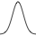

```{r 02_setup, include=FALSE}
knitr::opts_chunk$set(echo = TRUE, error = TRUE)
library(tufte)
library(tidyverse)
library(ggplot2)
library(ggmap)
library(tint)
library(mosaic)
# options(htmltools.dir.version = FALSE)
```

# (PART) Visualization {.unnumbered}

# Intro to Data Visualization

## Learning Goals {.unnumbered}

-   Understand the Grammar of Graphics
-   Use ggplot2 to create basic layers of graphics
-   Understand the different basic univariate visualizations for categorical and quantitative variables

You can download a template .Rmd of this activity [here](./template_rmd/02-Intro_Data_Viz_Assign.Rmd). Put this in a new folder called `Day_02` in your folder for `COMP_STAT_112`. 

## Benefits of Visualizations {.unnumbered}

-   Visualizations help us understand what we're working with:
    -   What are the scales of our variables?\
    -   Are there any outliers, i.e. unusual cases?\
    -   What are the patterns among our variables?\
-   This understanding will inform our next steps:
-   What method of analysis / model is appropriate?\
-   Once our analysis is complete, visualizations are a powerful way to communicate our findings and tell a story.

## Glyphs {.unnumbered}

In its original sense, in archaeology, a glyph is a carved symbol.

| Heiro**glyph**                 |                        Mayan **glyph** |
|--------------------------------|---------------------------------------:|
|  |  |

### Data Glyph {.unnumbered}

A data glyph is also a mark, e.g.

              

The features of a data glyph encodes the value of variables.

-   Some are very simple, e.g. a dot: 
-   Some combine different elements, e.g. a pointrange: 
-   Some are complicated, e.g. a dotplot: 

### Components of Graphics {.unnumbered}

```{r echo=FALSE,message=FALSE}
set.seed(102)
require(NHANES)
n <- 75
Tmp <-
  NHANES %>%
  mutate(
    smoker = derivedFactor(
      never = Smoke100 == "No",
      former = SmokeNow == "No",
      current = SmokeNow == "Yes",
      .ordered = TRUE
    ),
    sbp = BPSysAve,
    dbp = BPDiaAve,
    sex = Gender
  ) %>%
  select(sbp, dbp, sex, smoker) %>%
  sample_n(n) %>%
  filter(complete.cases(.)) %>%
  data.frame()
```

```{r fig-bp, echo=FALSE, fig.margin=TRUE,fig.cap="Blood pressure readings from a random subset of the NHANES data set."}
ggplot(data = Tmp) + geom_point(mapping = aes(x = sbp, y = dbp, shape = sex, color = smoker), size = 5, alpha = .8) + xlab("Systolic BP") + ylab("Diastolic BP") + scale_color_manual(values = c("#F8766D", "#00BFC4", "#00BA38"))
```

-   **frame**: The position scale describing how data are mapped to x and y
-   **glyph**: The basic graphical unit that represents one case.
    -   other terms used include *mark* and *symbol*.
-   **aesthetic**: a visual property of a glyph such as position, size, shape, color, etc.
    -   may be **mapped** based on data values: `smoker -> color`
    -   may be **set** to particular non-data related values: `color is black`
-   **facet**: a subplot that shows one subset of the data
    -   rather than represent `sex` by shape, we could split into two subplots
-   **scale**: A mapping that translates data values into aesthetics.
    -   example: never-\> <font color="#F8766D">pink</font>; former-\> <font color="#00BFC4">aqua</font>; current-\> <font color="#00BA38">green</font>
-   **guide**: An indication for the human viewer of the scale. This allows the viewer to translate aesthetics back into data values.
    -   examples: x- and y-axes, various sorts of legends

### Eye Training for the Layered Grammar of Graphics {.unnumbered}

```{exercise, name="Basic questions to ask of a data graphic"}
For your assigned graphic, discuss the following seven questions with your partner(s):

1. What variables constitute the frame?
2. What glyphs are used?
3. What are the aesthetics for those glyphs?
4. Which variable is mapped to each aesthetic?
5. Which variable, if any, is used for faceting?
6. Which scales are displayed with a guide?
7. What raw data would be required for this plot, and what form should it be in?

Here are the graphics examples, all taken from the New York Times website:

a. [Admissions gap](http://www.nytimes.com/interactive/2013/05/07/education/college-admissions-gap.html?_r=0)
#. [Medicare hospital charges](https://www.nytimes.com/interactive/2014/06/02/business/how-much-hospitals-charged-medicare-for-the-same-procedures.html)
#. [Football conferences](http://www.nytimes.com/newsgraphics/2013/11/30/football-conferences/)
#. [Housing prices](https://www.nytimes.com/interactive/2014/01/23/business/case-shiller-slider.html)
#. [Baseball pitching](http://www.nytimes.com/interactive/2013/03/29/sports/baseball/Strikeouts-Are-Still-Soaring.html)
#. [Phillips curve](http://www.nytimes.com/interactive/2013/10/09/us/yellen-fed-chart.html)
#. [School mathematics ratings](http://www.nytimes.com/interactive/2013/02/04/science/girls-lead-in-science-exam-but-not-in-the-united-states.html)
#. [Corporate taxes](http://www.nytimes.com/interactive/2013/05/25/sunday-review/corporate-taxes.html)

```

### Glyph-Ready Data {.unnumbered}

Note the mapping of data to aesthetics for Figure \@ref(fig:fig-bp):

       sbp [Systolic Blood Pressure] -> x      
       dbp [Diastolic Blood Pressure] -> y     
    smoker -> color
       sex -> shape

Glyph-ready data has this form:

-   There is one row for each glyph to be drawn.
-   The variables in that row are mapped to aesthetics of the glyph (including position).

```{r, echo=FALSE}
knitr::kable(
  Tmp[1:6, ], caption = 'A subset of the NHANES data set.'
)
```

## Data Visualization Workflow + `ggplot` {.unnumbered}

### Layers -- Building up Complex Plots {.unnumbered}

Using the `ggplot2` package, we can create graphics by building up layers, each of which may have its own data, glyphs, aesthetic mapping, etc. As an example, let's peel back the layers used to create Figure \@ref(fig:fig-bp).

The first layer just identifies the data set. It sets up a blank canvas, but does not actually plot anything:

```{r}
ggplot(data = Tmp)
```

Next, we add a geometry layer to identify the mapping of data to aesthetics for each of the glyphs:

```{r}
ggplot(data = Tmp) +
  geom_point(mapping = aes(x = sbp, y = dbp, shape = sex, color = smoker), size = 5, alpha = .8)
```

Next, we can add some axes labels as guides:

```{r}
ggplot(data = Tmp) +
  geom_point(mapping = aes(x = sbp, y = dbp, shape = sex, color = smoker), size = 5, alpha = .8) +
  xlab("Systolic BP") + ylab("Diastolic BP")
```

And, finally, we can change the scale of the color used for smoker status:

```{r}
ggplot(data = Tmp) +
  geom_point(mapping = aes(x = sbp, y = dbp, shape = sex, color = smoker), size = 5, alpha = .8) +
  xlab("Systolic BP") + ylab("Diastolic BP") +
  scale_color_manual(values = c("#F8766D", "#00BFC4", "#00BA38"))
```

If instead we wanted to facet into columns based on smoker status, we could add another layer for that:

```{r}
ggplot(data = Tmp) +
  geom_point(mapping = aes(x = sbp, y = dbp, shape = sex, color = smoker), size = 5, alpha = .8) +
  xlab("Systolic BP") + ylab("Diastolic BP") +
  scale_color_manual(values = c("#F8766D", "#00BFC4", "#00BA38")) +
  facet_grid(. ~ smoker)
```

For more information on all of the different types of layers we can add to graphics, see the [`ggplot2` reference page](https://ggplot2.tidyverse.org/reference/) and the [data visualization with `ggplot2` cheat sheet](https://raw.githubusercontent.com/rstudio/cheatsheets/main/data-visualization.pdf).

### Getting Started {.unnumbered}

There's no end to the number and type of visualizations you *could* make. Thus the process can feel overwhelming. [FlowingData](http://flowingdata.com/2017/01/24/one-dataset-visualized-25-ways/) makes good recommendations for data viz workflow:

-   **Ask the data questions.** Simple research questions will guide the types of visualizations that you should construct.\
-   **Start with the basics and work incrementally.** Before constructing complicated or multivariate or interactive graphics, start with simple visualizations. An understanding of the simple patterns provides a foundation upon which to build more advanced analyses and visualizations. This incremental process works particularly well with the layered grammar of graphics in `ggplot`.
-   **Focus.** Reporting a large number of visualizations can overwhelm the audience and obscure your conclusions. Instead, pick out a focused yet comprehensive set of visualizations. [Here](http://flowingdata.com/2017/01/24/one-dataset-visualized-25-ways/) is an example of one dataset visualized 25 different ways, each with a different focus and interpretation, and what can happen if you let the data ramble on without a focus.

In this course we'll largely construct visualizations using the `ggplot` function in RStudio. Though the `ggplot` learning curve can be steep, its "grammar" is intuitive and generalizable once mastered. The `ggplot` plotting function is stored in the `ggplot2` package:

```{r}
library(ggplot2)
```

The best way to learn about `ggplot` is to just play around. Focus on the *patterns* and *potential* of their application. It will be helpful to have the [RStudio Data Visualization cheat sheet](https://raw.githubusercontent.com/rstudio/cheatsheets/main/data-visualization.pdf) handy as you complete this activity.

### An Example {.unnumbered}

The "Bechdel test", named after cartoonist Alison Bechdel, tests whether movies meet the following criteria:

1.  There are $\ge$ 2 (named) female characters;\
2.  these women talk to each other...\
3.  about something other than a man.

In the fivethirtyeight.com article ["The Dollar-And-Cents Case Against Hollywood's Exclusion of Women"](http://fivethirtyeight.com/features/the-dollar-and-cents-case-against-hollywoods-exclusion-of-women/), the authors analyze which Hollywood movies do/don't pass the test. Their data are available in the `fivethirtyeight` package:

```{r eval=FALSE}
library(fivethirtyeight)
data(bechdel)
head(bechdel)
```

```{r echo=FALSE, warning=FALSE, message=FALSE}
library(fivethirtyeight)
library(knitr)
data(bechdel)
subb <- bechdel[, c(1, 2, 3, 5, 6, 11:13)]
# DT::datatable(subb, options = list(pageLength = 10))
suppressPackageStartupMessages(library(knitr))
kable(head(subb), font_size = 10)
```

```{exercise}
Before diving into any visualizations of these data, we first must understand its structure and contents. Discuss the following:  
  
  a. What are the units of observation and how many units are in this sample? 
  b. What are the levels of the `clean_test` and `binary` categorical variables?    
  c. Check out the codebook for `bechdel` (`?bechdel`).  What's the difference between `domgross_2013` and `domgross`?    
```

<details>

<summary>Solution</summary>

```{r,collapse=TRUE}
#units of observation are movies; there are 1794 movies in this sample
dim(bechdel)

#clean_test has values of "nowomen", "notalk", "men", "dubious", "ok"
#View(bchedel) and look at values or summarize like below
table(bechdel$clean_test)
levels(bechdel$clean_test)

#binary has values of PASS or FAIL
table(bechdel$binary)
levels(factor(bechdel$binary))

# domgross_2013 is the domestic gross in US dollars but it is inflation adjusted with respect to 2013
#?bechdel
```

</details>

\

```{exercise}
We'll consider *univariate* visualizations of the `clean_test` and `budget_2013` variables. Discuss the following:
  
  a. What features would we like a visualization of the *categorical* `clean_test` variable to capture?    
  b. What features would we like a visualization of the *quantitative* `budget_2013` variable to capture?    

```

<details>

<summary>Solution</summary>

a.  capture the frequency of each way a movie can fail or pass the Bechdel test
b.  capture the typical budget as well as how much variation there is across movies and if there are any outliers

</details>

\

### Categorical univariate visualization {.unnumbered}

We begin by stating a clear research question:

> Among the movies in our sample, what fraction pass the Bechdel test? Among those that fail the test, in which way do they fail (e.g., there are no women, there are women but they only talk about men,...)?

To answer the above research question, we can explore the categorical `clean_test` variable. A table provides a simple summary of the number of movies that fall into each `clean_test` category:

```{r}
table(bechdel$clean_test)
```

```{exercise}
Examine the table of `clean_test` data, and try to interpret it. What insights does it provide about the original research question?
```

<details>

<summary>Solution</summary>

Among the categories, the "ok" category was most frequent, meaning that 803 of the 1794 movies in the sample passed the Bechdel Test. However, among those 991 movies that did not pass the test, most of them (514 of them) did not pass because the women did not talk.

</details>

\

Because `clean_test` is a categorical variable, a **bar chart** provides an appropriate visualization of this table. In examining the bar chart, keep your eyes on the following.

-   **variability**: Are cases evenly spread out among the categories or are some categories more common than others?\
-   **contextual implications**: In the context of your research, what do you learn from the bar chart? How would you describe your findings to a broad audience?

```{exercise}
Try out the code below that builds up from a simple to a customized bar chart. At each step determine how each piece of code contributes to the plot.    
```

```{r eval=FALSE}
# plot 1: set up a plotting frame (a blank canvas)
ggplot(bechdel, aes(x = clean_test))

# plot 2: what changed / how did we change it?
ggplot(bechdel, aes(x = clean_test)) +
geom_bar()

# plot 3: what changed / how did we change it?
ggplot(bechdel, aes(x = clean_test)) +
geom_bar() +
labs(x = "Outcome of Bechdel Test", y = "Number of movies")

# plot 4: what changed / how did we change it?
ggplot(bechdel, aes(x = clean_test)) +
geom_bar(color = "purple") +
labs(x = "Outcome of Bechdel Test", y = "Number of movies")

# plot 5: what changed / how did we change it?
ggplot(bechdel, aes(x = clean_test)) +
geom_bar(fill = "purple") +
labs(x = "Outcome of Bechdel Test", y = "Number of movies")
```

<details>

<summary>Solution</summary>

```{r collapse = TRUE}
# plot 1: set up a plotting frame (a blank canvas)
ggplot(bechdel, aes(x = clean_test))

# plot 2: Added bars that reflect the count or frequency of the movies within each category
ggplot(bechdel, aes(x = clean_test)) +
geom_bar()

# plot 3: Added/changed the text labels for the x and y axes
ggplot(bechdel, aes(x = clean_test)) +
geom_bar() +
labs(x = "Outcome of Bechdel Test", y = "Number of movies")

# plot 4: Changed the outline color of the bars to purple
ggplot(bechdel, aes(x = clean_test)) +
geom_bar(color = "purple") +
labs(x = "Outcome of Bechdel Test", y = "Number of movies")

# plot 5: Changed the fill  color of the bars to purple
ggplot(bechdel, aes(x = clean_test)) +
geom_bar(fill = "purple") +
labs(x = "Outcome of Bechdel Test", y = "Number of movies")
```

</details>

\

```{exercise}
Summarize the visualization: what did you learn about the distribution of the `clean_test` variable?    

```

<details>

<summary>Solution</summary>

Among the categories, the "ok" category was most frequent. However, among those movies that did not pass the test, most of them did not pass because the women in the movie did not talk.

</details>

\

```{exercise}
Let's return to our research question: What percent of movies in the sample pass the Bechdel test? Among those that fail the test, in which way do they fail? 

```

<details>

<summary>Solution</summary>

```{r collapse=TRUE}
table(bechdel$binary)
803/(991 + 803)


table(bechdel$clean_test)[1:4]/991
```

</details>

\

### Quantitative univariate visualization {.unnumbered}

To motivate quantitative visualizations, consider a second research question

> Among the movies in our sample, what's the range of budgets? What's the typical budget? The largest/smallest?

We can answer the above research question by exploring the *quantitative* `budget_2013` variable. Quantitative variables require different summary tools than categorical variables. We'll explore two methods for graphing quantitative variables: histograms and density plots. Both of these has strengths/weaknesses in helping us visualize the distribution of observed values.

In their examination, keep your eyes on the following.

-   **center**: Where's the center of the distribution? What's a typical value of the variable?
-   **variability**: How spread out are the values? A lot or a little?
-   **shape**: How are values distributed along the observed range? Is the distribution symmetric, right-skewed, left-skewed, bi-modal, or uniform (flat)?\
-   **outliers**: Are there any *outliers*, ie. values that are unusually large/small relative to the bulk of other values?\
-   **contextual implications**: Interpret these features in the context of your research. How would you describe your findings to a broad audience?

#### Histograms {.unnumbered}

Histograms are constructed by (1) dividing up the observed range of the variable into 'bins' of equal width; and (2) counting up the number of cases that fall into each bin.

```{exercise}
Try out the code below.  At each step determine how each piece of code contributes to the plot.    

```

```{r eval=FALSE}
# plot 1: set up a plotting frame
ggplot(bechdel, aes(x = budget_2013))

# plot 2: what changed / how did we change it?
ggplot(bechdel, aes(x = budget_2013)) +
  geom_histogram()

# plot 3: what changed / how did we change it?
ggplot(bechdel, aes(x = budget_2013)) +
  geom_histogram() +
  labs(x = "Budget ($)", y = "Number of movies")

# plot 4: what changed / how did we change it?
ggplot(bechdel, aes(x = budget_2013)) +
  geom_histogram(color = "white") +
  labs(x = "Budget ($)", y = "Number of movies")

# plot 5: what changed / how did we change it?
ggplot(bechdel, aes(x = budget_2013)) +
  geom_histogram(fill = "white") +
  labs(x = "Budget ($)", y = "Number of movies")

# plot 6: what changed / how did we change it?
ggplot(bechdel, aes(x = budget_2013)) +
  geom_histogram(color = "white", binwidth = 500000) +
  labs(x = "Budget ($)", y = "Number of movies")

# plot 7: what changed / how did we change it?
ggplot(bechdel, aes(x = budget_2013)) +
  geom_histogram(color = "white", binwidth = 200000000) +
  labs(x = "Budget ($)", y = "Number of movies")
```

<details>

<summary>Solution</summary>

```{r eval=FALSE, collapse = TRUE}
# plot 1: set up a plotting frame
ggplot(bechdel, aes(x = budget_2013))

# plot 2: Added bars the represent the count of movies within budget intervals
ggplot(bechdel, aes(x = budget_2013)) +
  geom_histogram()

# plot 3: Updated the text on the x and y axis labels
ggplot(bechdel, aes(x = budget_2013)) +
  geom_histogram() +
  labs(x = "Budget ($)", y = "Number of movies")

# plot 4: The outline of the bars is now white
ggplot(bechdel, aes(x = budget_2013)) +
  geom_histogram(color = "white") +
  labs(x = "Budget ($)", y = "Number of movies")

# plot 5: The fill of the bars is now white
ggplot(bechdel, aes(x = budget_2013)) +
  geom_histogram(fill = "white") +
  labs(x = "Budget ($)", y = "Number of movies")

# plot 6: The width of the interval or bin is decreased to $500,000
ggplot(bechdel, aes(x = budget_2013)) +
  geom_histogram(color = "white", binwidth = 500000) +
  labs(x = "Budget ($)", y = "Number of movies")

# plot 7: The width of the interval or bin is increased to $200,000,000
ggplot(bechdel, aes(x = budget_2013)) +
  geom_histogram(color = "white", binwidth = 200000000) +
  labs(x = "Budget ($)", y = "Number of movies")
```

</details>

\

```{exercise}
Summarize the visualizations.    
  
  a. Describe the problem in choosing a bin width that's not too wide and not too narrow, but just right.    
  b. What did you learn about the distribution of the `budget_2013` variable?    
  c. Why does adding `color = "white"` improve the visualization?

```

<details>

<summary>Solution</summary>

a.  If the intervals (bars, bins) are too wide, then we lose information about the variation in the budget. Take it to the extreme with just 1 bar with the bar ranging from the minimum to the maximum. If the intervals are too small, then we have the frequency of the bars go up and down quite a bit. We might say that the shape of the bars isn't very smooth.

b.  Most of the movies have small budgets; the majority less of budgets are less than \$100,000,000 (in 2013 dollars) but there are some movies with upwards of \$300,000,000 (in 2013 dollars).

c.  Adding the white outline to the bars adds contrast and helps the viewer see where each bar starts and ends.

</details>

\

#### Density plots {.unnumbered}

**Density plots** are essentially smooth versions of the histogram. Instead of sorting cases into discrete bins, the "density" of cases is calculated across the entire range of values. The greater the number of cases, the greater the density! The density is then scaled so that the area under the density curve **always equals 1** and the area under any fraction of the curve represents the fraction of cases that lie in that range.

```{exercise}
Try the following code and assess what each line does.

```

```{r, eval=FALSE}
# plot 1: set up the plotting frame
ggplot(bechdel, aes(x = budget_2013))

# plot 2: what changed / how did we change it?
ggplot(bechdel, aes(x = budget_2013)) +
  geom_density()

# plot 3: what changed / how did we change it?
ggplot(bechdel, aes(x = budget_2013)) +
  geom_density() +
  labs(x = "Budget ($)")

# plot 4: what changed / how did we change it?
ggplot(bechdel, aes(x = budget_2013)) +
  geom_density(color = "red") +
  labs(x = "Budget ($)")

# plot 5: what changed / how did we change it?
ggplot(bechdel, aes(x = budget_2013)) +
  geom_density(fill = "red") +
  labs(x = "Budget ($)")
```

<details>

<summary>Solution</summary>

```{r, eval=FALSE, collapse = TRUE}
# plot 1: set up the plotting frame
ggplot(bechdel, aes(x = budget_2013))

# plot 2: add a smooth curve (shape of the histogram)
ggplot(bechdel, aes(x = budget_2013)) +
  geom_density()

# plot 3: updated the x axis label
ggplot(bechdel, aes(x = budget_2013)) +
  geom_density() +
  labs(x = "Budget ($)")

# plot 4: changed the color of the curve to red
ggplot(bechdel, aes(x = budget_2013)) +
  geom_density(color = "red") +
  labs(x = "Budget ($)")

# plot 5: filled the area under the curve to be red
ggplot(bechdel, aes(x = budget_2013)) +
  geom_density(fill = "red") +
  labs(x = "Budget ($)")
```

</details>

 

```{exercise}
The histogram and density plot both allow us to visualize the distribution of a quantitative variable.  What are the pros/cons of each?  Discuss.
```

## Additional exercises {.unnumbered}

```{exercise}
In July 2016, fivethirtyeight.com published the article ["Hip-Hop is Turning on Donald Trump""](https://projects.fivethirtyeight.com/clinton-trump-hip-hop-lyrics/).  You can find the supporting data table `hiphop_cand_lyrics` in the `fivethirtyeight` package:    
  
```

```{r eval=FALSE}
library(fivethirtyeight)
data(hiphop_cand_lyrics)
```

a.  What are the *cases* in this data set?\
b.  Use RStudio functions to:\

-   summarize the number of cases in `hiphop_cand_lyrics`\
-   examine the first cases of `hiphop_cand_lyrics`\
-   list out the names of all variables in `hiphop_cand_lyrics`

```{exercise}
Let's start our investigation of hip hop data by asking "Who?"; that is, let's identify patterns in which 2016 presidential candidates popped up in hip hop lyrics.    
  
  a. Use an RStudio function to determine the category labels used for the `candidate` variable.    
  b. Use `table` to construct a table of the number of cases that fall into each `candidate` category.    
  c. Construct a single plot that allows you to investigate the prevalence of each candidate in hip hop.  Make the following modifications:    
    - change the axis labels    
    - change the fill colors    
  d. Summarize your findings about the 2016 candidates in hip hop.
        
```

```{exercise}
Next, consider the release dates of the hip hop songs.    
  
  a. Construct a histogram of the release dates with the following modifications:    
    - change the fill color of the bins    
    - change the bin width to a meaningful size    
  b. Construct a density plot of the release dates with the following modifications:    
    - change the fill color    
  c. Summarize your findings about release date

```

```{exercise}
No class will teach you everything you need to know about RStudio or programming in general. Thus, being able to find help online is an important skill.  To this end, make a single visualization that incorporates the following modifications to your density plot from above.  This will require a little Googling and/or use of the visualization cheat sheet.    

  - Add a title or caption.    
  - Add *transparency* to the fill color.    
  - Calculate the mean (ie. average) release date and median release date:

```

```{r eval=FALSE}
mean(hiphop_cand_lyrics$album_release_date)
median(hiphop_cand_lyrics$album_release_date)
```

Add two vertical lines to your plot: one representing the mean and the other representing the median. Use two different colors and/or line types.

-   Change the limits of the x-axis to range from 1980-2020.

## Appendix: R Functions {.unnumbered}

### Basic R functions {.unnumbered}

| Function/Operator |                 Action                 |                       Example |
|-------------------------|:---------------------------:|------------------:|
| `table(x)`        |   Frequency count of categories in x   |   `table(bechdel$clean_test)` |
| `mean(x)`         | Average or mean of numeric values in x |   `mean(bechdel$budget_2013)` |
| `median(x)`       |     Median of numeric values in x      | `median(bechdel$budget_2013)` |

### ggplot2 foundation functions {.unnumbered}

| Function/Operator          |                                           Action                                           |                                        Example |
|-------------------------|:---------------------------:|------------------:|
| `ggplot(data)`             |            Create a blank canvas that can create a visualization based on data             |                       `ggplot(data = bechdel)` |
| `ggplot(data,aes())`       | Create a blank canvas that can create a visualization based on data with aesthetic mapping | `ggplot(data = bechdel, aes(x = budget_2013))` |
| `+ geom_bar(aes(x))`       |                                       Add a bar plot                                       |                `geom_bar(aes(x = clean_test))` |
| `+ geom_point(aes(x,y))`   |                                     Add a scatterplot                                      |        `geom_bar(aes(x = year,y=budget_2013))` |
| `+ geom_histogram(aes(x))` |                                      Add a histogram                                       |         `geom_histogram(aes(x = budget_2013))` |
| `+ geom_density(aes(x))`   |                                     Add a density plot                                     |           `geom_density(aes(x = budget_2013))` |

### more ggplot2 functions {.unnumbered}

| Function/Operator        |                                            Action                                            |                                        Example |
|-------------------------|:---------------------------:|------------------:|
| `+ xlab()`               |                                 Add an label for the x-axis                                  |                               `xlab('X axis')` |
| `+ ylab()`               |                                 Add an label for the y-axis                                  |                               `ylab('Y axis')` |
| `+ labs(x,y)`            |                               Add labels for the x and y-axis                                |             `labs(y = 'Y axis', x = 'X axis')` |
| `+ scale_color_manual()` |                         Set a color palette for the color aesthetic                          | `scale_color_manual(values = c('blue','red'))` |
| `+ facet_grid()`         | Create subplots based on categorical variables, groupvar_along_yaxis \~ groupvar_along_xaxis |                     `+ facet_grid(. ~ smoker)` |

### ggplot2 aesthetic mapping options {.unnumbered}

| Function/Operator |                      Action                      |                   Example |
|-------------------------|:---------------------------:|------------------:|
| `x`               |               variable for x-axis                |     `aes(x = clean_test)` |
| `y`               |               variable for y-axis                |    `aes(y = budget_2013)` |
| `color`           | variable for colors of points or strokes/outline | `aes(color = clean_test)` |
| `fill`            |       variable for fill of bars or shapes        |  `aes(fill = clean_test)` |
| `size`            |             variable for size shapes             | `aes(size = budget_2013)` |
| `shape`           |             variable for shape type              | `aes(shape = clean_test)` |
