```{r 03_setup, include=FALSE}
knitr::opts_chunk$set(echo = TRUE, error = TRUE)
library(tufte)
library(tidyverse)
library(ggplot2)
library(ggmap)
library(tint)
library(fivethirtyeight)
library(babynames) 
library(readr)
knitr::opts_chunk$set(tidy = FALSE, message=FALSE, cache.extra = packageVersion('tufte'))
# options(htmltools.dir.version = FALSE)
```

# Effective Visualizations

## Learning Goals {-}

- Understand and apply the guiding principles of effective visualizations

You can download a template .Rmd of this activity [here](template_rmd/03-Effective_Viz_Assign.Rmd). Put the file in a `Day_03` folder within your `COMP_STAT_112` folder.


## Effective Visualizations {-}

### Benefits of Visualizations {-}

Visualizations help us understand what we're working with: 

- What are the scales of our variables?  
- Are there any outliers, i.e. unusual cases?  
- What are the patterns among our variables?    

This understanding will inform our next steps: 

- What method of analysis / model is appropriate?    

Once our analysis is complete, visualizations are a powerful way to communicate our findings and **tell a story**.

### Analysis of Graphics {-}

There is not one right way to visualize a data set. 

However, there are guiding principles that distinguish between "good" and "bad" graphics. 

One of the best ways to learn is by reading graphics and determining which ways of arranging thing are better or worse. So before jumping directly into theoretical principles, let's try some critical analysis on specific examples. 

```{exercise}
For your assigned graphics or sets of graphics, identify the following:

1. the story the graphic is aiming to communicate to the audience
2. effective features of the graphic
3. areas for improvement
```


```{r,echo=FALSE, out.width = '50%',fig.show='hold',fig.cap="Source: http://viz.wtf/"}
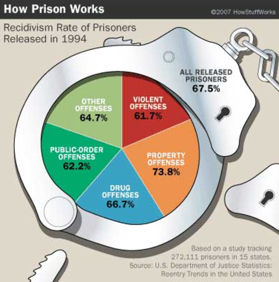
```

\
\
\

```{r,echo=FALSE, out.width = '50%',fig.show='hold',fig.cap="Source: N. Yau, *Visualize This*, 2011, p. 223-225."}
knitr::include_graphics("images/trilogies.gif")
```

\
\
\

```{r,echo=FALSE, out.width = '60%',fig.show='hold',fig.cap="Source: N. Yau, *Visualize This*, 2011, p. 242."}
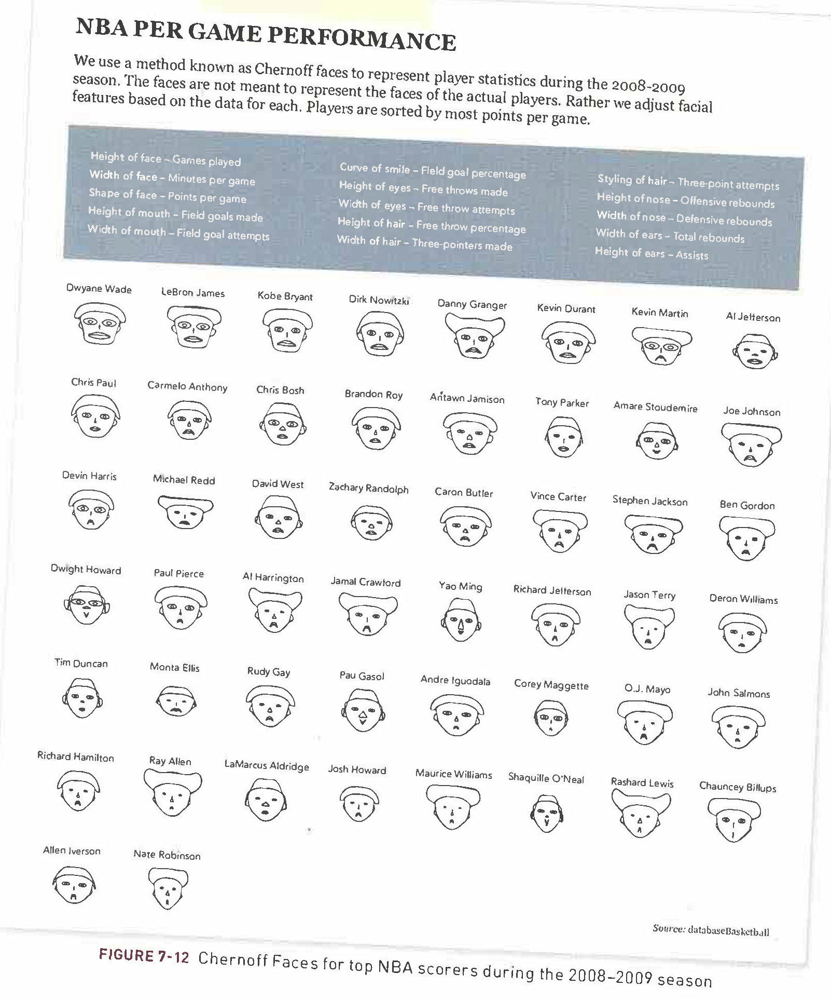
```

\
\
\

```{r,echo=FALSE, out.width = '70%',fig.show='hold',fig.cap="Gun deaths."}
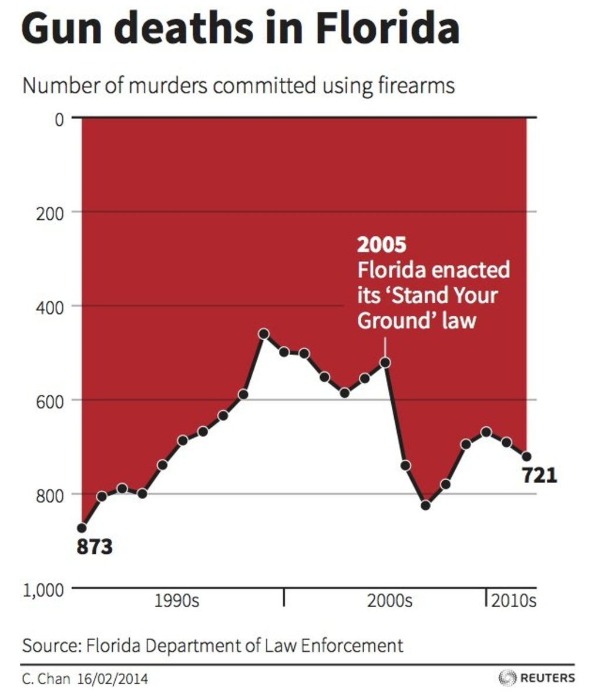
```

\
\
\

```{r,echo=FALSE, out.width = '80%',fig.show='hold',fig.cap="Source: N. Yau, *Visualize This*, 2011, p. 150."}
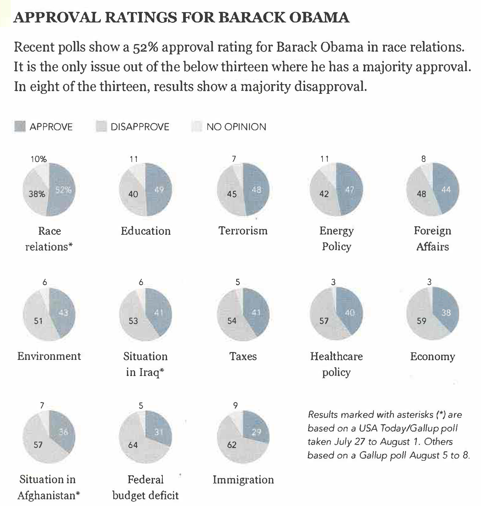
```

\
\
\

```{r,echo=FALSE, out.width = '80%',fig.show='hold',fig.cap="Source: C. N. Knaflic, *Storytelling with Data*, 2015, p. 142."}
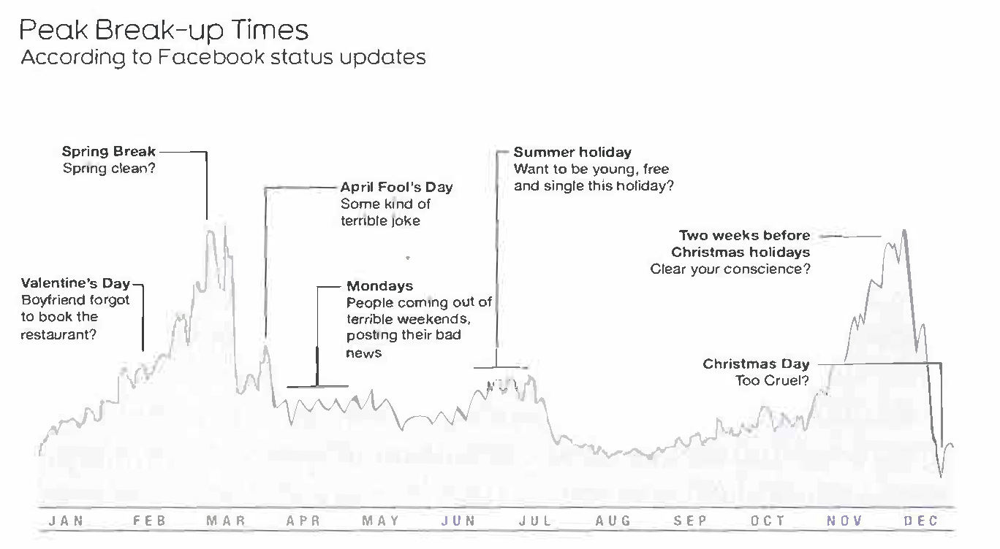
```

\
\
\

```{r,echo=FALSE, out.width = '60%',fig.show='hold',fig.cap="Source: S. Few, *Now You See It*, 2009, p. 45."}
knitr::include_graphics("images/heatmap.png")
```

\
\
\

```{r,echo=FALSE, out.width = '60%',fig.show='hold',fig.cap="Climate change."}
knitr::include_graphics("images/badviz1.png")
```

\
\
\

```{r,echo=FALSE, out.width = '50%',fig.show='hold',fig.cap="Source: C. N. Knaflic, *Storytelling with Data*, 2015, p. 48."}
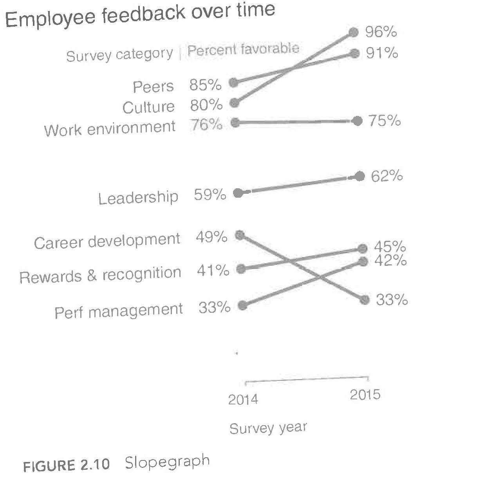
```

\
\
\

```{r,echo=FALSE,fig.width=3.5,fig.height=3,fig.fullwidth=TRUE,fig.show='hold',fig.cap="Diamond data visualizations from [*R for Data Science*](http://r4ds.had.co.nz/data-visualisation.html#position-adjustments), 2017"}
ggplot(data = diamonds) + 
  geom_bar(mapping = aes(x = cut, fill = cut))
ggplot(data = diamonds) + 
  geom_bar(mapping = aes(x = cut, fill = clarity))
ggplot(data = diamonds, mapping = aes(x = cut, fill = clarity)) + 
  geom_bar(alpha = 1/5, position = "identity")
ggplot(data = diamonds) + 
  geom_bar(mapping = aes(x = cut, fill = clarity), position = "fill")
ggplot(data = diamonds) + 
  geom_bar(mapping = aes(x = cut, fill = clarity), position = "dodge")
```

\
\
\

```{r,echo=FALSE, out.width = '100%',fig.show='hold',fig.cap="Source: S. Few, *Now You See It*, 2009, p. 37."}
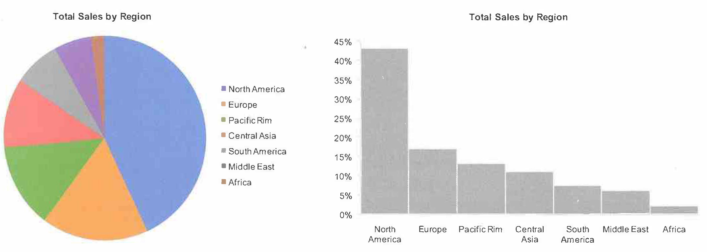
```

\
\
\

```{r,echo=FALSE, out.width = '70%',fig.show='hold',fig.cap="Source: N. Yau, *Visualize This*, 2011, p. 249."}
knitr::include_graphics("images/Nightingale.png")
```

\
\
\

```{r,echo=FALSE, out.width = '80%',fig.show='hold',fig.cap="Source: S. Few, *Now You See It*, 2009, p. 61."}
knitr::include_graphics("images/compensation.png")
```

\
\
\

```{r,echo=FALSE, out.width = '100%',fig.show='hold',fig.cap="Source: C. N. Knaflic, *Storytelling with Data*, 2015, p. 68."}
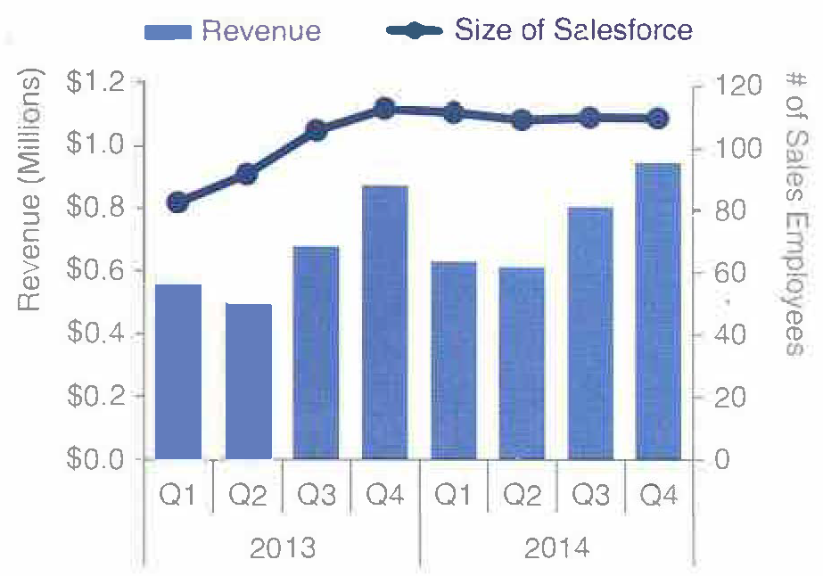
```

\
\
\

```{r,echo=FALSE, out.width = '70%',fig.show='hold',fig.cap="Source: C. N. Knaflic, *Storytelling with Data*, 2015, p. 81."}
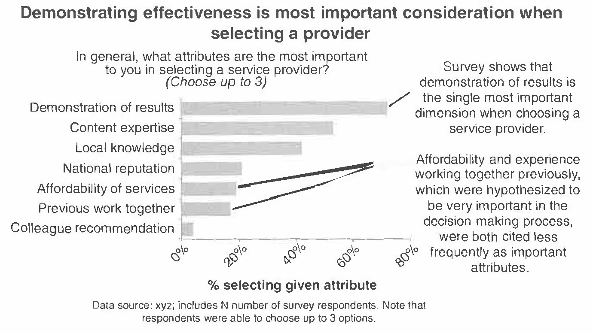
```

\
\
\

```{r,echo=FALSE, out.width = '60%',fig.show='hold',fig.cap="Source: http://viz.wtf/"}
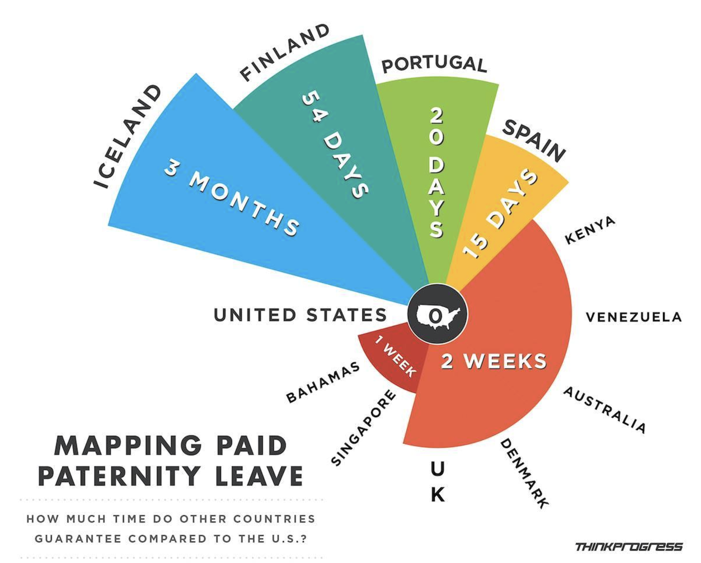
```

\
\
\

```{r,echo=FALSE, out.width = '85%',fig.show='hold',fig.cap="Source: A. Cairo, *The Functional Art*, 2013, p. 340."}
knitr::include_graphics("images/plagiarism.png")
```

\
\
\

```{r,echo=FALSE, out.width = '70%',fig.show='hold',fig.cap="Source: N. Yau, *Visualize This*, 2011, p. 220."}
knitr::include_graphics("images/tv-size-by-year1.png")
```

\
\
\

**More examples**:

- FlowingData: [blog](http://flowingdata.com/) and [Best visualizations of 2016](https://flowingdata.com/2016/12/29/best-data-visualization-projects-of-2016/)
- [WTF Visualizations](http://viz.wtf/)


### Properties of Effective Visualizations {-}

#### Storytelling / Context {-}

Remember ... 

> Graphics are designed by the human expert (you!) in order to reveal information that's in the data.

Your choices depend on what information you want to reveal and convey. So before you complete a graphic, you should clearly identify what story you want the graphic to tell to the audience, and double check that this story is being told.^[A "negative" result (e.g., there is no correlation between two variables) is a perfectly fine story to tell.]

[Here](https://fivethirtyeight.com/features/six-charts-to-help-americans-understand-the-upcoming-german-election/) is a nice example from `FiveThirtyEight` where each chart tells a story in answer to a particular question about the [then] upcoming German election. 

[Here](https://fivethirtyeight.com/features/gun-deaths/) is an interactive visualization that tells a story about gun violence. 

Another important contextual question to ask is whether the graphic is for an explanatory (*explain why*) or exploratory (*discovering something new*) analysis.

#### Ethics {-}

Michael Correll of Tableau Research writes "Data visualizations have a potentially enormous influence on how
data are used to make decisions across all areas of human
endeavor." in his [article from 2018](https://arxiv.org/pdf/1811.07271.pdf).


Visualization operates at the intersection of science, communication, and data science & statistics. There are professional standards of ethics in these fields of the power they hold over other people as it relates to making data-driven decisions. 

Correll describes three ethical challenges of visualization work:

1. **Visibility** Make the invisible visible 

  * Visualize hidden labor 
  * Visualize hidden uncertainty 
  * Visualize hidden impacts 
  
*Visualizations can be complex and one must consider the accessibility of the visualization to the audience. Managing complexity is, therefore, a virtue in design that can be in direct opposition with the desire to visualize the invisible.*

2. **Privacy** Collect data with empathy 

  * Encourage Small Data 
  * Anthropomorphize data 
  * Obfuscate data to protect privacy 
  
*Restricting the type and amount of data that is collected has a direct impact on the quality and scope of the analyses hence obligation to provide context, and analytical power can, therefore, stand in direct opposition to the empathic collection of data.*

3. **Power** Challenge structures of power 

* Support data due process. 
* Act as data advocates. 
* Pressure unethical analytical behavior. 

*The goal of promoting truth and suppressing falsehood may require amplifying existing structures of expertise and power, and suppressing conflicts for the sake of rhetorical impact.*


At a minimum, you should always

1. Present data in a way that avoids misleading the audience. 

2. Always include your data source. Doing so attributes credit for labor, provides credibility to your work, and provides context for your graphic.


#### Design {-}

A basic principle is that a graphic is about *comparison*.  Good graphics make it easy for people to perceive things that are similar and things that are different.  Good graphics put the things to be compared "side-by-side," that is, in perceptual proximity to one another. The following aesthetics are listed in roughly descending order of human ability to perceive and compare nearby objects:^[This list is from B. S. Baumer, D. T. Kaplan, and N. J. Horton, *Modern Data Science with R*, 2017, p. 15. For more of the theory of perception, see also 
W.S. Cleveland and R. McGill, "[Graphical perception: Theory, experimentation, and application to the development of graphical methods](http://www.math.pku.edu.cn/teachers/xirb/Courses/biostatistics/Biostatistics2016/GraphicalPerception_Jasa1984.pdf)," *Journal of the American Statistical Association*, 1984.]

1. Position
2. Length
3. Angle
4. Direction
5. Shape (but only a very few different shapes)
6. Area
7. Volume
8. Shade
9. Color

Color is the most difficult, because it is a 3-dimensional quantity. We are pretty good at color gradients, but discrete colors must be selected carefully. We need to be particularly aware of red/green color blindness issues.    

**Visual perception and effective visualizations**

Here are some facts to keep in mind about visual perception from [Now You See It](https://www.amazon.com/Now-You-See-Visualization-Quantitative/dp/0970601980):

1. Visual perception is selective, and our attention is often drawn to constrasts from the norm.

```{r,echo=FALSE, out.width = '100%',fig.fullwidth=TRUE,fig.cap="Our attention is drawn to contrasts to the norm. What stands out in this example image?, which is originally from C. Ware, *Information Visualization: Perception for Design*, 2004? Source: S. Few, *Now You See It*, 2009, p. 33."}
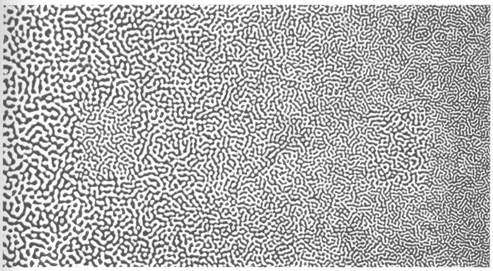
```

> **Implication**: We should design visualizations so that the features we want to highlight stand out in contrast from those that are not worth the audience's attention.

2. Our eyes are drawn to familiar patterns. We see what we know and expect.

```{r,echo=FALSE, out.width = '90%',fig.fullwidth=TRUE,fig.cap="Do you see anything embedded in this rose image from coolbubble.com? Source: S. Few, *Now You See It*, 2009, p. 34."}

```

> **Implication**: Visualizations work best when they display information as patterns that familiar and easy to spot.

3. Memory plays an important role in human cognition, but working memory is extremely limited.

> **Implication**: Visualizations must serve as external aids to augment working memory. If a visualization is unfamiliar, then it won't be as effective.

**Gestalt principles**

The Gestalt principles (more info [here](https://en.wikipedia.org/wiki/Principles_of_grouping) or  [here](https://www.smashingmagazine.com/2014/03/design-principles-visual-perception-and-the-principles-of-gestalt/)) were developed by psychologists including Max Wertheimer in the early 1900s to explain how humans perceive organized patterns and objects. 

In a design setting, they help us understand how to incorporate **preattentive features** into visualizations. The figure below shows some preattentive features, all of which are processed prior to conscious attention ("at a glance") and can help the reader focus on relevant information in a visualization.

```{r,echo=FALSE, out.width = '100%',fig.fullwidth=TRUE,fig.cap="Preattentive features based on the Gestalt principles. Source: I. Meirelles, *Design for Information*, 2013, p. 23."}
knitr::include_graphics("images/gestalt.png")
```

**Other design tips** from [Visualize This](https://www.amazon.com/Visualize-This-FlowingData-Visualization-Statistics/dp/0470944889/) and [Storytelling with Data](https://www.amazon.com/Storytelling-Data-Visualization-Business-Professionals/dp/1119002257):

- Put yourself in a reader's shoes when you design data graphics. What parts of the data need explanation? We can minimize ambiguity by providing guides, label axes, etc.
- Data graphics are meant to shine a light on your data. Try to remove any elements that don't help you do that. That is, eliminate "chart junk" (distracting and unnecessary adornments). 
- Vary color and stroke styles to emphasize the parts in your graphic that are most important to the story you're telling 
- It is easier to judge length than it is to judge area or angles
- Be thoughtful about how your categories (levels) are ordered for categorical data. There may be a natural ordering
- Pie charts, donut charts, and 3D are evil


### Basic Rules for Constructing Graphics {-}

Instead of memorizing which plot is appropriate for which situation, it's best to simply start to recognize patterns in constructing graphics:

- Each quantitative variable requires a new axis.    
- Each categorical variable requires a new way to "group" the graphic (eg: using colors, shapes, separate facets, etc to capture the grouping).
- For visualizations in which overlap in glyphs or plots obscures the patterns, try faceting or transparency. 


### Still to Come {-}

While we will not cover all of visualization theory -- you can take a whole course on that at Macalester and it is a proper field in its own right -- we will touch on the following types of visualizations in the coming weeks:

- Univariate and bivariate visualizations
- Visualizations of higher dimensional data
- Temporal structures: timelines and flows
- Hierarchical structures: trees
- Relational structures: networks
- Spatial structures: maps
- Spatio-temporal structures
- Textual structures
- Interactive graphics (e.g., `gganimate`, `shiny`)


## Exercises {-}


```{exercise}
Consider one of the more complicated data graphics listed at (http://mdsr-book.github.io/exercises.html#exercise_25):

a. What story does the data graphic tell? What is the main message that you take away from it?
b. Can the data graphic be described in terms of the Grammar of Graphics (frame, glyphs, aesthetics, facet, scale, guide)? If so, please describe.
c. Critique and/or praise the visualization choices made by the designer. Do they work? Are they misleading? Thought-provoking? Brilliant? Are there things that you would have done differently? Justify your response.
```