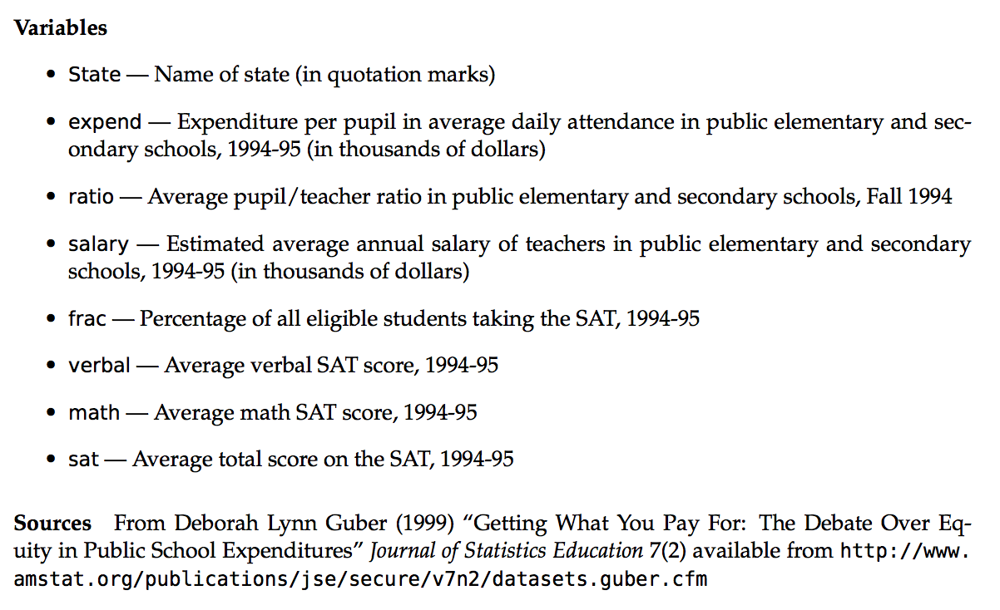

```{r 05_setup, include=FALSE}
knitr::opts_chunk$set(echo = TRUE, error = TRUE, tidy = FALSE, message = FALSE, cache.extra = packageVersion("tufte"))
library(tidyverse)
library(ggplot2)
library(gplots)
```

# Multivariate Visualizations

## Learning Goals {-}

- Understand how we can use additional aesthetics such as color and size to incorporate a third (or more variables) to a bivariate plot
- Develop comfort with interpreting heat maps and star plots, which allow you to look for patterns in variation in many variables. 

You can download a template .Rmd of this activity [here](template_rmd/05-Multivariate_Viz_Assign.Rmd). Put this in a new folder called `Day_05` in your folder for `COMP_STAT_112`. 

## Adding More Aesthetic Attributes {-}

### Exploring SAT Scores {-}

Though far from a perfect assessment of academic preparedness, SAT scores have historically been used as one measurement of a state's education system.  The `education` data stored at [https://www.macalester.edu/~ajohns24/data/sat.csv](https://www.macalester.edu/~ajohns24/data/sat.csv) contain various education variables for each state:

```{r}
education <- read.csv("https://www.macalester.edu/~ajohns24/data/sat.csv")
```

```{r, echo=FALSE}
knitr::kable(
  education[1:6, ],
  caption = "The first few rows of the SAT data."
)
```

A codebook is provided by Danny Kaplan who also made these data accessible:

```{r, echo=FALSE,out.width="750px",fig.cap="Codebook for SAT data. Source: https://www.macalester.edu/~kaplan/ISM/datasets/data-documentation.pdf"}

```

To examine the variability in average SAT scores from state to state, let's start with a univariate density plot:

```{r, fig.width=6,fig.height=3}
ggplot(education, aes(x = sat)) +
  geom_density(fill = "blue", alpha = .5)
```

The first question we'd like to answer is to what degree do per pupil spending (`expend`) and teacher `salary` *explain* this variability? We can start by plotting each against `sat`, along with a best fit linear regression model:

```{r, fig.width=3,fig.height=3,fig.fullwidth=TRUE,fig.show='hold'}
ggplot(education, aes(y = sat, x = salary)) +
  geom_point() +
  geom_smooth(se = FALSE, method = "lm") + 
  theme_classic()

ggplot(education, aes(y = sat, x = expend)) +
  geom_point() +
  geom_smooth(se = FALSE, method = "lm") + 
  theme_classic()
```

```{exercise}
Is there anything that surprises you in the above plots? What are the relationship trends?
```

<details>

<summary>Solution</summary>

These seem to suggest that spending more money on students or teacher salaries correlates with lower SAT scores. Say it ain't so!


</details>

\

```{exercise}
Make a single scatterplot visualization that demonstrates the relationship between `sat`, `salary`, and `expend`. Summarize the trivariate relationship between `sat`, `salary`, and `expend`. 
```
*Hints: 1. Try using the color or size aesthetics to incorporate the expenditure data. 2. Include some model smooths with `geom_smooth()` to help highlight the trends.*

<details>

<summary>Solution</summary>

Below are four different plots. There seems to be a high correlation between `expend` and `salary`, and both seem to be negatively correlated with `sat`.

```{r, fig.width=8, fig.fullwidth=TRUE}

#plot 1
g1 <- ggplot(education, aes(y=sat, x=salary, color=expend)) + 
    geom_point() + 
    geom_smooth(se=FALSE, method="lm") + theme_classic()
    
#plot 2
g2 <- ggplot(education, aes(y=sat, x=salary, size=expend)) + 
    geom_point() + 
    geom_smooth(se=FALSE, method="lm") + theme_classic()

#plot 3
g3 <- ggplot(education, aes(y=sat, x=salary, color=cut(expend,2))) + 
    geom_point() + 
    geom_smooth(se=FALSE, method="lm") + theme_classic()

#plot 4
g4 <- ggplot(education, aes(y=sat, x=salary, color=cut(expend,3))) + 
    geom_point() + 
    geom_smooth(se=FALSE, method="lm") + theme_classic()

library(gridExtra)
grid.arrange(g1, g2, g3, g4, ncol=2)
```

</details>

\


```{exercise}
The `fracCat` variable in the `education` data categorizes the fraction of the state's students that take the SAT into `low` (below 15%), `medium` (15-45%), and `high` (at least 45%).
```

a. Make a univariate visualization of the `fracCat` variable to better understand how many states fall into each category.   
b. Make a bivariate visualization that demonstrates the relationship between `fracCat` and `sat`. What story does your graphic tell?
c. Make a trivariate visualization that demonstrates the relationship between `fracCat`, `sat`, and `expend`. Incorporate `fracCat` as the color of each point, and use a single call to `geom_smooth` to add three trendlines (one for each `fracCat`). What story does your graphic tell?   
d. Putting all of this together, explain this example of **Simpson’s Paradox**. That is, why does it appear that SAT scores decrease as spending increases even though the opposite is true?   


## Other Multivariate Visualization Techniques {-}

### Heat maps {-}    

Note that each variable (column) is scaled to indicate states (rows) with high values (yellow) to low values (purple/blue).  With this in mind you can scan across rows & across columns to visually assess which states & variables are related, respectively. You can also play with the color scheme. Type `?cm.colors` in the console to see various options.    

```{r, fig.width=10, fig.height=20, cache=TRUE}
ed <- as.data.frame(education) # convert from tibble to data frame

# convert to a matrix with State names as the row names
row.names(ed) <- ed$State 
ed <- ed[, 2:8]
ed_mat <- data.matrix(ed)

heatmap.2(ed_mat,
  Rowv = NA, Colv = NA, scale = "column",
  keysize = 0.7, density.info = "none",
  col = hcl.colors(256), margins = c(10, 20),
  colsep = c(1:7), rowsep = (1:50), sepwidth = c(0.05, 0.05),
  sepcolor = "white", cexRow = 2, cexCol = 2, trace = "none",
  dendrogram = "none"
)
```    

```{exercise}
What do you notice? What insight do you gain about the variation across U.S. states?
```


**Heat map with row clusters** 

It can be tough to identify interesting patterns by visually comparing across rows and columns.  Including *dendrograms* helps to identify interesting clusters.

```{r, fig.width=10, fig.height=20,cache=TRUE}
heatmap.2(ed_mat,
  Colv = NA, scale = "column", keysize = .7,
  density.info = "none", col = hcl.colors(256),
  margins = c(10, 20),
  colsep = c(1:7), rowsep = (1:50), sepwidth = c(0.05, 0.05),
  sepcolor = "white", cexRow = 2, cexCol = 2, trace = "none",
  dendrogram = "row"
)
```  

```{exercise}
What do you notice? What new insight do you gain about the variation across U.S. states, now that states are grouped and ordered to represent similarity?
```


**Heat map with column clusters** 

We can also construct a heat map which identifies interesting clusters of columns (variables).

```{r, fig.width=10, fig.height=20, cache=TRUE}
heatmap.2(ed_mat,
  Rowv = NA, scale = "column", keysize = .7,
  density.info = "none", col = hcl.colors(256),
  margins = c(10, 20),
  colsep = c(1:7), rowsep = (1:50), sepwidth = c(0.05, 0.05),
  sepcolor = "white", cexRow = 2, cexCol = 2, trace = "none",
  dendrogram = "column"
)
```   

```{exercise}
What do you notice? What new insight do you gain about the variation across U.S. states, now that variables are grouped and ordered to represent similarity?
```


### Star plots  {-}  

There's more than one way to visualize multivariate patterns. Like heat maps, these star plot visualizations indicate the relative scale of each variable for each state.  With this in mind, you can use the star maps to identify which state is the most "unusual." You can also do a quick scan of the second image to try to cluster states. How does that clustering compare to the one generated in the heat map with row clusters above?    

```{r, fig.width=15, fig.height=18, cache=TRUE}
stars(ed_mat,
  flip.labels = FALSE,
  key.loc = c(15, 1.5), cex = 1.5
)
stars(ed_mat,
  flip.labels = FALSE,
  key.loc = c(15, 1.5), cex = 1.5, draw.segments = TRUE
)
```   

```{exercise}
What do you notice? What new insight do you gain about the variation across U.S. states with the star plots?
```
    
    
