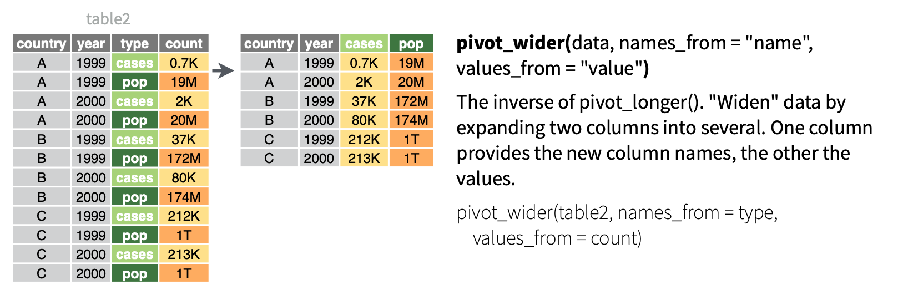
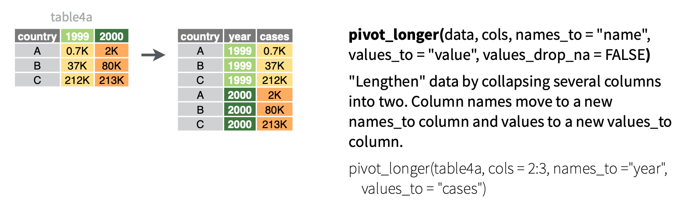

```{r 08_setup, include=FALSE}
knitr::opts_chunk$set(echo = TRUE, error = TRUE, tidy = FALSE, message = FALSE, cache.extra = packageVersion("tufte"))
library(tidyverse)
library(ggplot2)
library(lubridate)
library(ggmap)
library(fivethirtyeight)
library(babynames)
BabyNames <- babynames
colnames(BabyNames)[4] <- "count"
```

# Reshaping Data

## Learning Goals {-}

- Understand the difference between wide and long data format and distinguish the case (unit of observation) for a given data set
- Develop comfort in using `pivot_wider` and `pivot_longer` in the `tidyr` package

You can download a template .Rmd of this activity [here](template_rmd/08-Reshaping_Data_Assign.Rmd). Put the file in a folder `Day_08` in your `COMP_STAT_112` folder.


## Wide and Long Data Formats {-}

Additional reading: 

* [Wickham and Grolemund on pivoting](https://r4ds.had.co.nz/tidy-data.html#pivoting), or 
* [Baumer, Kaplan, and Horton on reshaping data](https://mdsr-book.github.io/mdsr2e/ch-dataII.html#reshaping-data)

As we are transforming data, it is important to keep in mind what constitutes each case (row) of the data. For example, in the initial `BabyNames` data below, each case is a single name-sex-year combination. So if we have the same name and sex assigned at birth but a different year, that would be a different case.

```{r, echo=FALSE}
knitr::kable(
  BabyNames[1:6, ],
  caption = "Each case is one name-sex-year combination."
)
```

It is often necessary to rearrange your data in order to create visualizations, run statistical analysis, etc. We have already seen some ways to rearrange the data to change the unit of observation (also known as case). For example, what is the case after performing the following command?

```{r}
BabyNamesTotal <- BabyNames %>%
  group_by(name, sex) %>%
  summarise(total = sum(count))
```

Each case now represents one name-sex combination:

```{r, echo=FALSE}
knitr::kable(
  BabyNamesTotal[1:6, ],
  caption = "Long format where each case is one name-sex combination."
)
```

In this activity, we are going to learn two new operations to reshape and reorganize the data: `pivot_wider()` and `pivot_longer()`.

### Wider {-}

```{example}
We want to find the common names that are the most gender neutral (used roughly equally for males and females). How should we rearrange the data? 
```

Well, one nice way would be to have a single row for each name, and then have separate variables for the number of times that name is used for males and females. Using these two columns, we can then compute a third column that gives the ratio between these two columns. That is, we'd like to transform the data into a **wide format** with each of the possible values of the `sex` variable becoming its own column. The operation we need to perform this transformation is **`pivot_wider()`**. 

The inputs for this function are:

-  `values_from`  (`total` in this case) representing the variable to be divided into multiple new variables, 
- `names_from` (the original variable `sex` in this case) that identifies the variable in the initial long format data whose values should become the names of the new variables in the wide format data. 
- `values_fill = 0` specifies that if there are, e.g., no females named Aadam, we should include a zero in the corresponding entry of the wide format table
- `names_sort = TRUE` dictates that the variables are listed in alphabetical order; when it is FALSE, they are listed in order of first appearance.

```{r echo=FALSE,fig.cap="Illustration of pivot_wider from tidyr cheatsheet."}

```


```{r}
BabyWide <- BabyNamesTotal %>%
  pivot_wider(names_from = sex, values_from = total, values_fill = 0, names_sort = TRUE)
```

```{r, echo=FALSE}
knitr::kable(
  BabyWide[1:6, ],
  caption = "A wide format with one case per name enables us to examine gender balance."
)
```

Now we can choose common names with frequency greater than 25,000 for both males and females, and sort by the ratio to identify gender-neutral names.

```{r}
Neutral <- BabyWide %>%
  filter(M > 25000, F > 25000) %>%
  mutate(ratio = pmin(M / F, F / M)) %>% #pmin() stands for parallel min, finds the min(M/F, F/M) for each row
  arrange(desc(ratio))
```

```{r, echo=FALSE}
knitr::kable(
  Neutral[1:12, ],
  caption = "The most gender-neutral common names, in wide format."
)
```

### Longer {-}

Next, let's filter these names to keep only those with a ratio of 0.5 or greater (no more than 2 to 1), and then switch back to long format. We can do this with the following **`pivot_longer()`** operation. It gathers the columns listed c(`F`,`M`) under the `cols` argument into a single column whose name is given by the `names_to` argument ("sex"), and includes the values in a column called `total`, which is the input to the `values_to` argument.

```{r echo=FALSE,fig.cap="Illustration of pivot_longer from tidyr cheatsheet."}

```

```{r}
NeutralLong <- Neutral %>%
  filter(ratio >= .5) %>%
  pivot_longer(cols = c(`F`, `M`), names_to = "sex", values_to = "total") %>%
  select(name, sex, total) %>%
  arrange(name)
```

```{r, echo=FALSE}
knitr::kable(
  NeutralLong[, ],
  caption = "Long format for the most gender-neutral common names."
)
```


## Example: The Daily Show Guests {-}

The data associated with [this article](https://fivethirtyeight.com/datalab/every-guest-jon-stewart-ever-had-on-the-daily-show/) is available in the `fivethirtyeight` package, and is loaded into `Daily` below. It includes a list of every guest to ever appear on Jon Stewart's The Daily Show. Note that when multiple people appeared together, each person receives their own line.

```{r}
Daily <- daily_show_guests
```

```{r, echo=FALSE}
knitr::kable(
  Daily[132:142, ]
)
```

### Popular guests {-}

```{exercise}
Create the following table containing 19 columns. The first column should have the ten guests with the highest number of total apperances on the show, listed in descending order of number of appearances. The next 17 columns should show the number of appearances of the corresponding guest in each year from 1999 to 2015 (one per column). The final column should show the total number of appearances for the corresponding guest over the entire duration of the show (these entries should be in decreasing order). Hint: the function `rowSums()` adds up all of the entries in each row of a table. Try using it in a `mutate`.

```

### Recreating a graphic {-}

The original data has 18 different entries for the `group` variable:

```{r}
unique(Daily$group)
```

In order to help you recreate the first figure from [the article](https://fivethirtyeight.com/datalab/every-guest-jon-stewart-ever-had-on-the-daily-show/), I have added a new variable with three broader groups: (i) entertainment; (ii) politics, business, and government, and (iii) commentators. The data is available [here](data/daily-group-assignment.csv). We will learn in the next activity what the `inner_join` in this code chunk is doing.


```{r eval = FALSE,echo=TRUE}
DailyGroups <- read_csv("https://bcheggeseth.github.io/112_fall_2022/data/daily-group-assignment.csv")
Daily <- Daily %>%
  inner_join(DailyGroups, by = c("group" = "group"))
```

```{r eval = TRUE,echo=FALSE}
DailyGroups <- read_csv("data/daily-group-assignment.csv")
Daily <- Daily %>%
  inner_join(DailyGroups, by = c("group" = "group"))
```

```{r,echo=FALSE}
knitr::kable(
  Daily[1:6, ]
)
```

```{exercise}
Using the group assignments contained in the `broad_group` variable, recreate the graphic from the article, with three different lines showing the fraction of guests in each group over time. Hint: first think about what your case should be for the glyph-ready form.

```


## More Exercises: Practice Pivoting Longer {-}

A typical situation that requires a `pivot_longer` command is when the columns represent the possible values of a variable. Table \@ref(tab:lesotho-table) shows example data set from [opendataforafrica.org](http://dataportal.opendataforafrica.org/) with different years in different columns. You can find the data [here](data/Lesotho.csv).

```{r, warning=FALSE,message=FALSE,eval=FALSE,echo=TRUE}
Lesotho <- read_csv("https://bcheggeseth.github.io/112_fall_2022/data/Lesotho.csv")
```

```{r, warning=FALSE,message=FALSE,eval=TRUE,echo=FALSE}
Lesotho <- read_csv("data/Lesotho.csv")
```

```{r lesotho-table, echo=FALSE}
knitr::kable(
  Lesotho[, ],
  digits = 2, caption = "Financial statistics about Lesotho."
)
```


```{exercise,name="Practice pivoting longer"}
Make a side-by-side bar chart with the `year` on the horizontal axis, and three side-by-side vertical columns for average interest rate on deposits, average interest rate on loans, and inflation rate for each year. In order to get the data into glyph-ready form, you'll need to use `pivot_longer`. Hint: `pivot_longer` uses the `dplyr::select()` notation, so you can, e.g., list the columns you want to select, use colon notation, or use `starts_with(a string)`. See [Wickham and Grolemund](https://r4ds.had.co.nz/transform.html#select) for more information.

```


## Appendix: R Functions {.unnumbered}

### Reshaping Functions {.unnumbered}

| Function/Operator |                 Action                 |                       Example |
|-------------------------|:---------------------------:|------------------:|
| `pivot_wider()`        |   Takes a long data set and spreads information in columns into many new variables (wider)  |   `BabyNamesTotal %>% pivot_wider(names_from = sex, values_from = total, values_fill = 0, names_sort = TRUE)` |
| `pivot_longer()`        | Takes a wide data set and gathers information in columns into fewer variables (longer) |   ` Neutral %>% pivot_longer(cols = c(`F`, `M`), names_to = "sex", values_to = "total")` |
