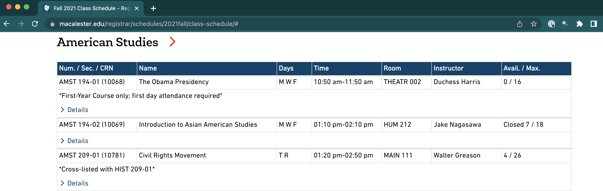
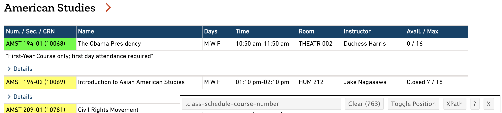
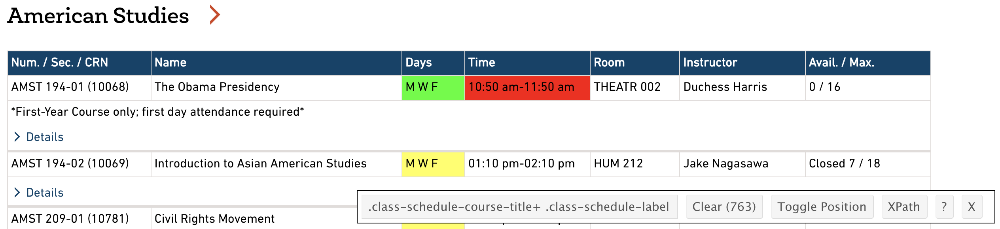
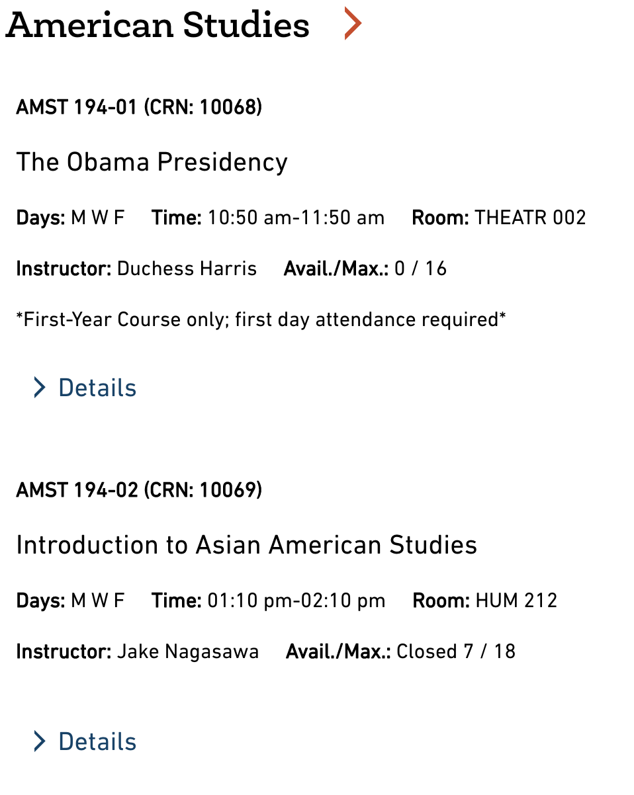

```{r 15_setup, include=FALSE}
knitr::opts_chunk$set(echo = TRUE, error = TRUE, tidy = FALSE, message = FALSE, cache.extra = packageVersion("tufte"))
library(tidyverse)
library(lubridate)
library(rvest)
```


# (PART) Additional Topics {-}
# Data Acquisition: Scraping the Web {-}

## Learning Goals {-}

- Develop comfort in using CSS Selectors and the Selector Gadget to identify data of interest within a website
- Use `html_nodes` and `html_text` within `rvest` packages to scrape data from websites using CSS selectors
- Develop initial comfort in cleaning text data


You can download a template .Rmd of this activity [here](template_rmd/15-Data_Scraping.Rmd).


## Scraping Data {-}


Additional readings:  

* [rvest](https://www.analyticsvidhya.com/blog/2017/03/beginners-guide-on-web-scraping-in-r-using-rvest-with-hands-on-knowledge/)     
* [CSS selectors](https://css-tricks.com/how-css-selectors-work/)

While a great deal of data is available via Web APIs, data download link, and data warehouses, not all of it is. Programs can use a process called **web scraping** to collect data that is available to humans (via web browsers) but not computer programs. 

### Finding CSS Selectors {-}

In order to gather information from a webpage, we must learn the language used to identify patterns of specific information. For example, on the [Macalester Registrar's Fall 2021 Class Schedule](https://www.macalester.edu/registrar/schedules/2021fall/class-schedule) you can visually see that the data is represented in a table. The first column shows the course number, the second the title, etc.

```{r echo=FALSE,fig.cap="Subset of Macalester registration data for Fall 2021."}

```

We will identify data in a webpage using a pattern matching language called [CSS Selectors](https://css-tricks.com/how-css-selectors-work/) that can refer to specific patterns in HTML, the language used to write web pages. 

For example, the CSS selector "a" selects all hyperlinks in a webpage ("a" represents "anchor" links in HTML), "table > tr > td:nth-child(2)" would find the second column of an HTML table.

**Warning**: Websites change often! So if you are going to scrape a lot of data, it is probably worthwhile to save and date a copy of the website. Otherwise, you may return after some time and your scraping code will include all of the wrong CSS selectors.

Although you can [learn how to use CSS Selectors by hand]([CSS Selectors](https://css-tricks.com/how-css-selectors-work/)), we will use a shortcut by installing the [Selector Gadget](http://selectorgadget.com/) for Chrome. 

Yes, you must have the Chrome web browser installed to do this! You "teach" the Selector Gadget which data you are interested in on a web page, and it will show you the CSS Selector for this data. We will eventually use this selector in `R`.

First watch the [Selector Gadget](http://selectorgadget.com/) video and install the Chrome Extension.

Head over to the [Macalester Registrar's Fall 2021 class schedule](https://www.macalester.edu/registrar/schedules/2021fall/class-schedule/). Click the selector gadget icon in the top right corner of Chrome (you may need to click on the puzzle piece and then the pin icon next to the Selector). As you mouse over the webpage, different parts will be highlighted in orange. Click on the first course number, `AMST 194-01`. You'll notice that the Selector Gadget information in the lower right describes what you clicked on:

```{r echo=FALSE,fig.cap="The Selector Gadget in action: Mousing over the course number (left), and the result pane after clicking on the course number (right)."}

```

Scroll through the page to verify that only the information you intend (the course number) is selected. The selector panel shows the CSS selector (`.class-schedule-course-number`) and the number of matches for that CSS selector (763).

Now that we have the selector for the course number, let's find the selector for the days of the week. Clear the selector by clicking the "Clear" button on the result pane, and then click the `MWF` under days for `AMST 194-01`. You will notice that the selector was too broad and highlighted information we don't want. You need to teach Selector Gadget a correct selector by clicking the information you **don't want** to turn it red. Once this is done, you should have 763 matches and a CSS selector of `.class-schedule-course-title+ .class-schedule-label`.

```{r echo=FALSE,fig.cap="Results for the Selector Gadget after selecting the day field."}

```

```{exercise}
Repeat the process above to find the correct selectors for the following fields. Make sure that each matches 763 results:
```

  1) Course Number
  2) Course Name
  3) Day
  4) Time
  5) Room
  6) Instructor
  7) Avail. / Max


### Retrieving Data Using `rvest` and CSS Selector {-}

Now that we have identified CSS selectors for the information we need, let's fetch the data in `R`. We will be using the `rvest` package, which retrieves information from a webpage and turns it into R data tables:

```{r}
fall2021 <- read_html("https://www.macalester.edu/registrar/schedules/2021fall/class-schedule")
```

Once the webpage is loaded, we can retrieve data using the CSS selectors we specified earlier. The following code retrieves the course numbers and names as a vector:

```{r}
# Retrieve and inspect course numbers
course_nums <-
  fall2021 %>%
  html_nodes(".class-schedule-course-number") %>%
  html_text()
head(course_nums)

# Retrieve and inspect course names
course_names <-
  fall2021 %>%
  html_nodes(".class-schedule-course-title") %>%
  html_text()
head(course_names)

```

At the end of each course number entry is a 5 digit number, which is CRN number used internally for the registrar's office. Let's put that in its own variable.

To clean up the course number data, we can chop off the last 6 characters of each entry using the command `sub_str` from the `stringr` package:^[This is a simple example of text processing with regular expressions. We'll learn how to deal with more complicated situations in the text processing unit.]

```{r}
course_nums_clean <- stringr::str_sub(course_nums, end = nchar(course_nums) - 6)
head(course_nums_clean)

crn <- stringr::str_sub(course_nums, start = nchar(course_nums) - 4)
head(crn)

course_df <- tibble(number = course_nums_clean,crn = crn, name = course_names)
head(course_df)
```

What happens when we try to grab the instructors in the same manner?

```{r}
course_instructors <-
  fall2021 %>%
  html_nodes(".class-schedule-label:nth-child(6)") %>%
  html_text()
head(course_instructors)
```

In front of each entry is a bunch of spaces and "Instructor: ", which we don't really need stored in every entry of our data table. This is because the website is set up in a responsive manner to change when the browser window is narrowed or you are on a mobile device. 

```{r echo=FALSE,out.width=500,fig.cap="View of the schedule when the browser window is narrower."}

```

To clean up the data, we can chop off the white space with `trimws` and then first 12 characters of each entry using the command `sub_str` from the `stringr` package:^[This is a simple example of text processing with regular expressions. We'll learn how to deal with more complicated situations in the text processing unit.]

```{r}
course_instructors_short <- stringr::str_sub(trimws(course_instructors), start = 13)
head(course_instructors_short)
```

```{exercise}
Create a data table that contains all the information about courses you found selectors for earlier (7 columns). Do not include any extraneous information like "Instructor: ".

```


```{exercise} 
Create a chart that shows the number of sections offered per department. *Hint: The department is a substring of the course number*.^[Yes, COMP, STAT, and MATH are the same department, but for this exercise you can just show the results by four letter department code, e.g., with COMP, STAT, and MATH separate.] 

```

```{exercise}
Analyze the typical length of course names by department. To do so, create a `dplyr` pipeline that creates a new data table based on your courses data table, with the following changes:
```

  1) New columns for the length of the title of a course. Hint: `nchar`.
  2) Remove departments that have fewer than 10 sections of courses. To do so, group by department, then remove observations in groups with fewer than 10 sections (Hint: use `filter` with `n()`). Then `ungroup` the data so it flattens it back into a regular data table. This is one of the rare cases when we will use `group_by` without `summarize`.
  3) Create a visualization of the differences across groups in lengths of course names. Think carefully about the visualization you should be using!


*Note: If you'd like to see the html code for a website, in Chrome go to View > Developer > Developer Tools. Through this, we can see that all of the details about the course such as gen. ed. requirements, distributional requirements, and course description are contained on external links the correspond to the CRN numbers (#####): https://webapps.macalester.edu/registrardata/classdata/Fall2021/##### If you'd like a challenge, use that CRN variable we created above to pull out the description and gen ed. requirements for each class and join that data with the course information data table.*


### Web Scraping in Python {-}

If you prefer to use Python rather than `R`, there are also great web scraping tools in Python. The equivalent to `rvest` in Python is called **BeautifulSoup**. Here is a reference for learning web scraping in Python:

- [Web Scraping with Python](https://www.amazon.com/Web-Scraping-Python-Collecting-Modern/dp/1491910291/), by Ryan Mitchell, O'Reilly, 2015 (the second version is [here](https://www.amazon.com/Web-Scraping-Python-Collecting-Modern-dp-1491985577/dp/1491985577/ref=dp_ob_title_bk))

## Additional Practice: Analyze WNBA Players {-}

```{exercise}

This is an open-ended activity that asks you to analyze data from [Basketball-Reference.com](https://www.basketball-reference.com/wnba/years/2021_per_game.html). For this task, you will need to scrape at Women's NBA players statistics from 2021. You are welcome to pursue an analysis that interests you about these players. Here are some examples you might choose:

* Which players are "the most valuable" players?

* How do teams compare in terms of their players?

```
