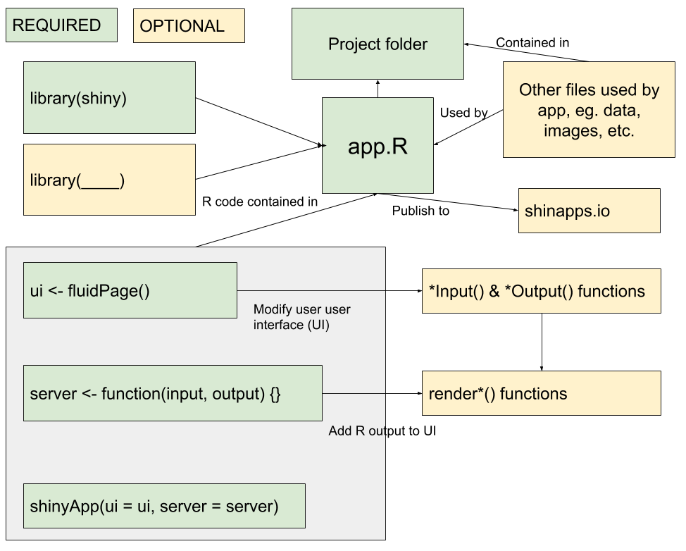

```{r 20_setup, include=FALSE}
knitr::opts_chunk$set(echo = TRUE, error = TRUE, tidy = FALSE, message = FALSE, cache.extra = packageVersion("tufte"))
library(tidyverse)
library(flair) 
```

# Shiny  {-}

## Learning Goals {-}

- Create a shiny app that requires inputs.
- Publish a shiny app to shinyapps.io or the Macalester Shiny server (https://rstudio-connect.macalester.edu/).

## What is a Shiny App? {-}

In this section, we will learn how to create a Shiny App. Shiny Apps are applications that allow the user to interact or make changes to graphs or tables. You will learn how to create them in R and how to deploy them on your own [shinyapps.io](https://shinyapps.io) webpage or the Macalester Shiny server (https://rstudio-connect.macalester.edu/). See examples of some Shiny apps [here](https://shiny.rstudio.com/gallery/).

I recommend having the [Shiny cheatsheet](https://raw.githubusercontent.com/rstudio/cheatsheets/main/shiny.pdf) open while you are learning about Shiny. Also consider watching at least the first part of [this tutorial](https://shiny.rstudio.com/tutorial/) by Garrett Grolemund.

### Structure of a Shiny App {-}

To see an example of a Shiny App, go to File > New File > Shiny Web App. Give it the title of `First_Shiny_App` and make sure the single file button is checked. 

Our application will be contained in an `app.R` file. The file contains two key components:

`ui`: code for the user interface. The user interface is the webpage that your user will interact with. Don’t worry, you don’t need to know how to write html! The app will do that for you! (Although if you want to, there are opportunities to incorporate that knowledge into a Shiny app.)

`server`: code for the computer part. What should the computer/server do with your inputs as the user changes them. This section will have R code in it, more like we’re used to … sort of.

I always keep these names as the default. The last chunk of code at the bottom, `shinyApp(ui = ui, server = server)`, will compile everything together to result in the interactive webpage.

Press **Run App** at the top of RStudio and see what happens!

### Concept Map {-}

The concept map below illustrates the key components of a Shiny app and how they relate to one another. 

```{r echo=FALSE,fig.cap='Concept Map of Shiny by Lisa Lendway'}

```

## Creating an app {-}

Creating a Shiny app is different from what we've done so far in this class. One of the biggest changes, is that we'll be working from .R files, rather than .Rmd files. In .R files, *everything* is read as R code. So, it's like one big R code chunk. If you want to make comments, you need to use the pound/hashtag symbol, `#`.

Let's start by downloading this blank [`app.R`](template_rmd/app.R) file and opening it in RStudio. 

Open the file and click Run App. This is a *really* boring app - there is nothing there! But, it is a great starting point because it gives you an outline of what you need in order to make your app work.

Before getting into a lot of details, let's add a little bit to the app. At the top of the file (before the `ui`), load the `tidyverse` and `babynames` libraries and add some text in quotes inside the `fluidPage()` function.Run the app. 

Now, let's move on to creating a more interesting app. Your goal is to create a Shiny app for your friends to explore the `babynames` dataset!

**Requirements:** 

* Show the number of babies with a given name over time.  
* Allow the user to type a single name. (Ideally, it should give a message if there are no records of the name that was typed, but we won't worry about that now.)  
* Allow the user to choose a range of years they would like to display. 
* Allow the user to filter by sex.

### Details {-}

How do we do this?

* Save this app.R file in a folder with a descriptive name such as, `Babynames_App`
* Add `ui` components  
* Add `server` components  
* Deploy to a server to share with others!

Let's learn more about these!

### What is an app.R file? {-}

Like we've already seen in the sample app files, these contain two key components: `ui` and `server`.

We will add different `*Input()` and `*Output()` functions to the `ui`.  

* The `*Input*()` functions collect inputs from the user.  
* The `*Output()` functions work with the `render*()` functions in the `server` portion to to add R output to the UI. 

### `*Input()` functions {-}

The `*Input()` functions collect inputs from the user. The various types are listed on the right-hand side of the first page of the cheatsheet. You will list all the `*Input()` functions you want to use with their accompanying arguments inside the `fluidPage()` function in the `ui` portion. Separate the `*Input()` functions with commas. 

In all the `*Input()` functions, the first two arguments are the same: 
  * `inputId` is how you will call this input in the `server` portion later, 
  * `label` is how this will actually be labeled in your UI. Each function has some additional arguments depending what you want to do.

#### Exercise {-}

In the `app.R` file you just created, add three inputs inside the `fluidPage()` function. Be sure to separate them with commas.

* `sliderInput()` to choose the start and end year for the eventual graph.  
* `textInput()` to write a name.  
* `selectInput()` to choose a binary sex assigned at birth.

Once you complete all the necessary arguments, run your app. Make sure you can enter and move things around as expected. There won't be a graph yet because we haven't created it. 

### `*Output()` functions {-}

`*Output()` functions in the `ui` portion work with the `render*()` functions in the `server` portion to to add R output to the UI. The `*Output()` functions are listed in the bottom center part of the first page of the cheatsheet. 

All the `*Output()` functions have the same first argument, `outputId`, which is used how you will call this output in the `server` portion later (like the `inputId` in the `*Input()` functions).

#### Exercise {-}

Add a `plotOutput()` to the `fluidPage()` function. Run the app with the output. Notice that nothing really changes. Think of this output as a placeholder. So, it knows there is going to be a plot in the UI, but the details of what the plot will look like and the R code to create it will be in the server portion. Let's talk about that!

### Using `render*()` functions  {-}

In the server portion of the code, we will use `render*()` functions with R code to communicate how to use the input pieces along with the R code to create the desired output. The `render*()` function you use will depend on the desired output. The bottom center of the cheatsheet shows how `*Output()` and `render*()` functions connect.

In general, the `server` section of code will look something like this:

```{r eval=FALSE}
server <- function(input, output) {
  output$outputId_of_interest <- render*({
R code that creates the output and calls various input$InputId's
  })
}
```

So, if inside the `ui` part, we did `plotOutput(outputId = "timeplot")`, then in the `server` part, we would use `output$timeplot <- renderPlot({...})` and put in detailed R code in place of the `...`. To reference the inputs we create in the `ui`, we use `input$inputID_name`. So, for example, if we had an `*Input()` with `inputId = "years"`, we would use `input$years` in the `server` portion.

Since we are interested in creating a plot, add the `renderPlot()` function inside the `server` portion of the code. Reference the inputs you've already created in previous parts and use `filter()` and `ggplot()` to render the desired interactive plot. Run the app and check your work by looking at the code chunk below (so don't look ahead, if you want to try it out on your own!). I also added a submit button to the UI so everything is updated at the same time, only when the button is clicked. You should try adding that, too.

Below, I have also included all the R code used to create the app. I have highlighted the `inputId` and `outputId` similarly in the `ui` and `server` portions to draw attention to where they are referenced. 

```{r app-code, echo=FALSE, eval=FALSE}
library(shiny)
library(tidyverse)
library(babynames)

ui <- fluidPage(
  sliderInput(inputId = "years", 
              label = "Year Range",
              min = 1880, 
              max = 2017, 
              value = c(1880,2017),
              sep = ""),
  textInput("name", 
            "Baby Name", 
            value = "", 
            placeholder = "Brianna"),
  selectInput("sex", 
              "Sex Assigned at Birth", 
              choices = list(Female = "F", Male = "M")),
  submitButton(text = "Update Plot"),
  plotOutput(outputId = "timeplot")
)

server <- function(input, output) {
  output$timeplot <- renderPlot({
    babynames %>% 
      filter(name == input$name, 
             sex == input$sex) %>% 
      ggplot() +
      geom_line(aes(x = year, y = n)) +
      scale_x_continuous(limits = input$years) +
      labs(x = 'Year', y = 'Count', title = paste0('Count of Baby Names in the U.S. from ',input$years[1],' to ',input$years[2])) + 
      theme_classic()
  })
}

shinyApp(ui = ui, server = server)
```

```{r echo=FALSE}
decorate_chunk("app-code",eval=FALSE) %>% 
  flair('"years"') %>% 
  flair("input$years") %>% 
  flair('"name"', background = "orange") %>% 
  flair("input$name", background = "orange") %>% 
  flair('"sex"', background = "lightgreen") %>% 
  flair("input$sex", background = "lightgreen") %>% 
  flair('"timeplot"', background = "lightblue") %>% 
  flair("output$timeplot", background = "lightblue") %>%
  knit_print.with_flair()
```

### Publishing your app {-}

The first step is to nstall and load the `rsconnect` library in your R Studio session. 

**Option 1 (Macalester Shiny Server)**

*This option allows you to share your applications with individuals on Macalester campus or who have VPN access to the Macalester network.*

1. Go to [https://rstudio-connect.macalester.edu/](https://rstudio-connect.macalester.edu/) and click Sign In in the upper-right.
2. Use your Macalester username (before `@macalester.edu`) and your existing Macalester password.
3. Run the app in RStudio. In the upper right-hand corner, there is an option to publish the app (blue half circle icon with dot in the middle). Click on that and then click `Add new account` > RStudio Connect. The public url is `rstudio-connect.macalester.edu`. It will open a webpage and ask you to authenticate your connect account.
4. When you create an app, save it as `app.R` in a folder. It **MUST** be named `app.R`. In the `app.R` file, load all libraries you use in your code. Also try not to have extra libraries or it will take longer to get it on the website. Any data that your app uses needs to be read in within the app. If the data are local to your computer, you need to have the data in the same folder as the app.    
5. Run the app. In the upper right-hand corner, there is an option to publish the app. Click on that. It will take a bit of time to do it the first time. Once published, you can go to the app via the webpage provided.

You should set permissions so that `Anyone - no login required` can view your application. The URL to share your application is under Content URL on the bottom right.

**Option 2 (Shinyapps.io)**

*This option allows you to share your applications with any individual with internet access unless you make it password protected.*

1. Register at [https://www.shinyapps.io/admin/#/signup](https://www.shinyapps.io/admin/#/signup).  
2. Once you are logged in to shinyapps.io, go to Account --> Tokens and click the Show button.  
3. Copy and paste the code into the console in R. This will connect your account to R Studio. 
4. When you create an app, save it as `app.R` in a folder. It **MUST** be named `app.R`. In the `app.R` file, load all libraries you use in your code. Also try not to have extra libraries or it will take longer to get it on the website. Any data that your app uses needs to be read in within the app. If the data are local to your computer, you need to have the data in the same folder as the app.    
5. Run the app. In the upper right-hand corner, there is an option to publish the app. Click on that. It will take a bit of time to do it the first time. Once published, you can go to the app via the webpage provided.

The instructions are set out in more detail [here](https://shiny.rstudio.com/articles/shinyapps.html). 

You can see the example of my sample app before it was published in the shiny_app folder of all my files (note that the `rsconnect` folder is added after publishing the app).


## More Practice {-}

Try adding something more to the app. Here are a couple ideas.

1. Return a message if the user enters a name that is not found in the data set. By the way, this will happen if someone enters a name with all lowercase letters, too. How could you solve that problem?

2. Allow the user to enter more than one name and compare the graphs either by coloring different lines or using faceting.  

3. Allow the user to change something about the graph, like the color of the line or the type of line.


